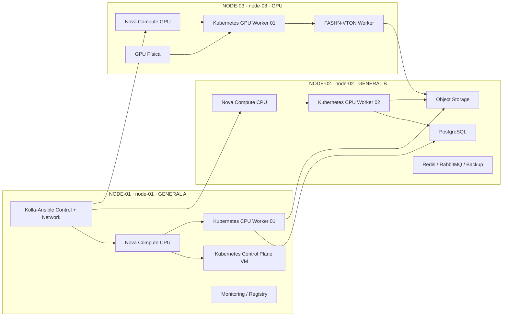
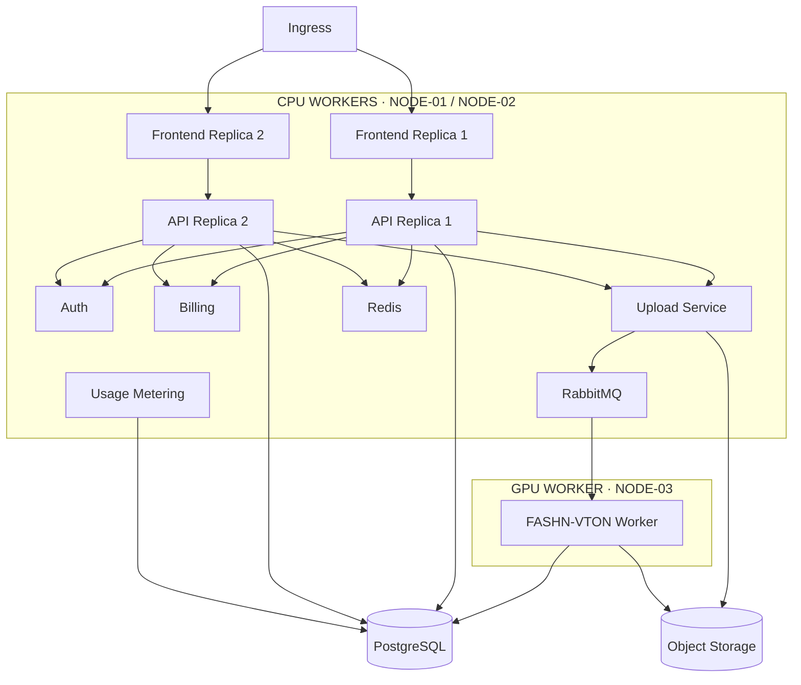
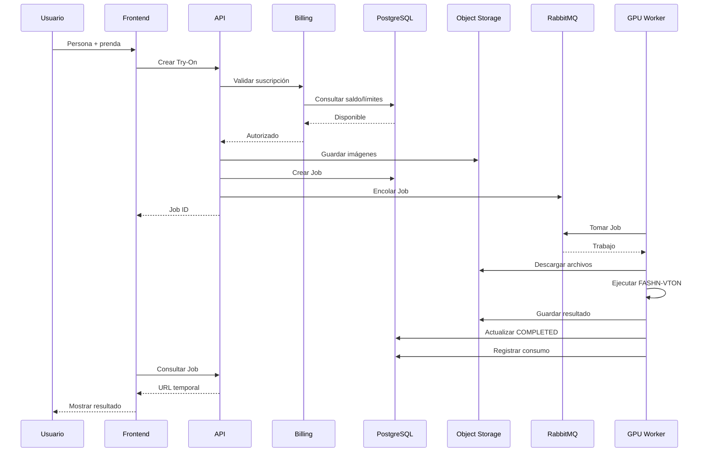
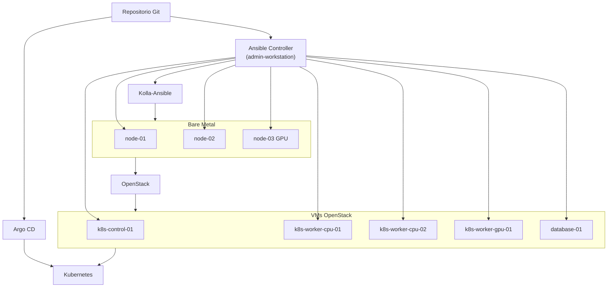
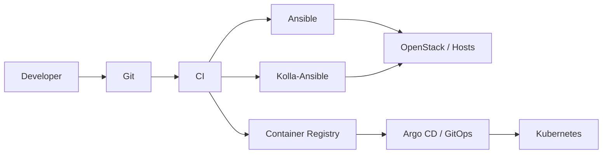
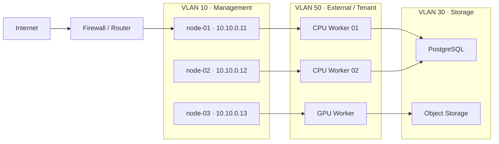
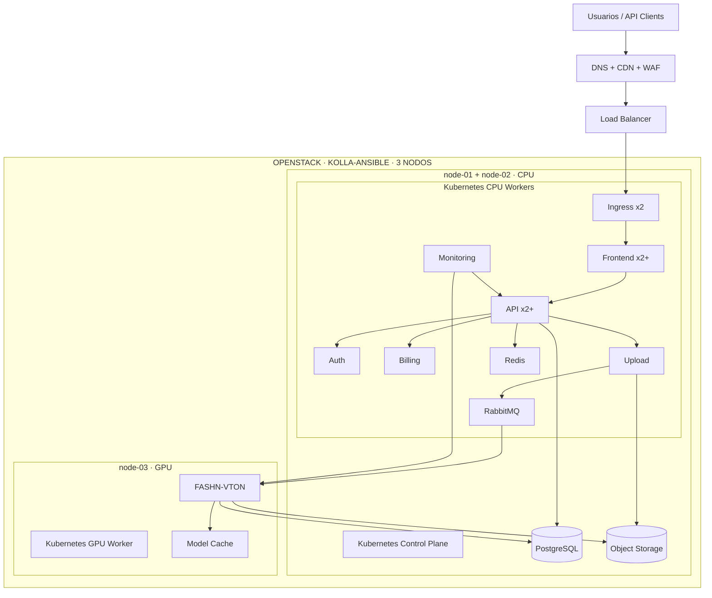

# Arquitectura de Plataforma SaaS de Virtual Try-On
## OpenStack (Kolla-Ansible) + Kubernetes + FASHN-VTON 1.5
### Fase inicial: 3 nodos físicos en una red local

**Versión:** 4.0
**Fecha:** 24 de septiembre de 2026
**Estado:** Documento unificado (Arquitectura + Plan de trabajo), enfocado en una cloud OpenStack local para montar el SaaS de IA.
**Método OpenStack:** Kolla-Ansible (elegido — ver justificación en §1 y §10).
**Orquestación:** Kubernetes (obligatorio, no opcional).
**GPU:** 1 sola (NODE-03).
**Topología:** red local única, un solo sitio (sin WireGuard, sin multi-sitio).

> **Decisión de método OpenStack:** se elige **Kolla-Ansible** frente a OpenStack-Ansible (OSA) porque:
> 1. Despliega los servicios de OpenStack en **contenedores Docker**, coherente con la filosofía de contenedores/Kubernetes del propio SaaS.
> 2. Es **más simple de operar** para un clúster de 3 nodos (1 control + 2 compute), mientras que OSA añade una capa LXC, un `deploy-node` separado y 4 bridges que son sobreingeniería para esta escala.
> 3. **Upgrades y rollbacks por imágenes** de contenedor, más predecibles y automatizables.
> 4. El documento de arquitectura previo (V3) ya anticipaba adoptar Kolla-Ansible.

---

# 1. Resumen ejecutivo

La plataforma ofrecerá un servicio web de **Virtual Try-On**: un usuario o sistema externo envía una fotografía de una persona y una fotografía de una prenda, solicita el procesamiento mediante **FASHN-VTON 1.5** y recibe una imagen con el resultado.

Se comercializará como **SaaS de suscripción y consumo** (planes, créditos, límites de concurrencia, historial auditable).

La arquitectura utilizará:

- **3 nodos físicos en una red local** (un solo sitio).
- **OpenStack (Kolla-Ansible)** como capa de infraestructura privada, desplegada en contenedores.
- **Kubernetes** como plataforma de orquestación de la aplicación.
- **Ansible** para bootstrap, hardening, preparación de hosts/VMs y orquestación de Kolla-Ansible.
- **Un nodo GPU** dedicado a inferencia.
- **Procesamiento asíncrono** mediante una cola de trabajos.
- **Object Storage** para fotografías y resultados.
- **PostgreSQL** como base transaccional.
- **Redis** para cache y datos temporales.
- **Prometheus, Grafana y logs centralizados** para observabilidad.
- **Medición de consumo** para facturación y control de planes.

```text
3 NODOS FÍSICOS · RED LOCAL
│
├── NODE-01  node-01  · CONTROL + COMPUTE CPU
├── NODE-02  node-02  · COMPUTE CPU + DATOS
└── NODE-03  node-03  · COMPUTE GPU (1 sola GPU)
```

Con tres servidores y una única GPU, algunos componentes conservarán puntos únicos de fallo físicos. Por tanto, esta fase es **producción inicial o piloto con redundancia parcial y capacidad de crecimiento**, no HA física completa. La incorporación futura de nodos CPU/GPU no requerirá rediseñar la aplicación.

---

# 2. Objetivos

La plataforma deberá permitir:

- registro de usuarios;
- creación de organizaciones;
- autenticación;
- administración de roles;
- definición de planes;
- administración de suscripciones;
- administración de créditos;
- carga de fotografías;
- carga de prendas;
- creación de trabajos de Virtual Try-On;
- procesamiento mediante GPU;
- consulta del estado del trabajo;
- almacenamiento de resultados;
- descarga de resultados;
- historial de generaciones;
- medición de consumo;
- facturación;
- límites por plan;
- integración mediante API;
- monitoreo técnico;
- monitoreo de negocio;
- auditoría.

---

# 3. Restricción inicial de infraestructura

La primera etapa utilizará exactamente tres servidores físicos en una red local.

| Nodo | Rol principal | GPU | Servicios principales |
|---|---|---:|---|
| NODE-01 | Control + cómputo general | No | Kolla-Ansible (control + network), Nova Compute CPU, Kubernetes control plane, workloads CPU |
| NODE-02 | Cómputo general + datos | No | Nova Compute CPU, Kubernetes worker CPU, PostgreSQL, almacenamiento y servicios auxiliares |
| NODE-03 | Cómputo especializado | Sí | Nova Compute GPU, Kubernetes worker GPU, FASHN-VTON |

Los nombres, IPs y roles exactos de cada host están definidos en el archivo **`.env`** (fuente de verdad de direccionamiento) y se reproducen en §57 y §67.

---

# 4. Principios de diseño

| Principio | Aplicación |
|---|---|
| Separación CPU/GPU | El procesamiento de IA no compite con frontend y backend |
| Procesamiento asíncrono | Las solicitudes de IA se envían a una cola |
| Stateless web tier | Frontend y API no guardan estado local permanente |
| Persistencia externa | DB y Object Storage mantienen los datos |
| Escalamiento horizontal | Frontend/API pueden aumentar réplicas |
| Medición de consumo | Cada Try-On genera un registro auditable |
| Multi-tenant | Usuarios y consumo se agrupan por organización |
| Contenedores | Todos los servicios (OpenStack y aplicación) se empaquetan |
| Orquestación | Kubernetes gestiona workloads de aplicación |
| Infraestructura privada | OpenStack (Kolla-Ansible) administra VMs, red y almacenamiento |
| Observabilidad | Métricas, logs y trazas centralizadas |
| Crecimiento progresivo | Nuevos nodos se incorporan sin rediseñar la solución |
| Automatización reproducible | Ansible + Kolla-Ansible configuran hosts y VMs desde código versionado |

# 5. Arquitectura física inicial



> Diagrama PlantUML equivalente: `diagrams/00-fisica-3-nodos.puml`.

---

# 6. Responsabilidad de cada nodo físico

## 6.1 NODE-01 — General A / Control

Será el nodo principal de control.

El **control de Ansible no dependerá de NODE-01**: se ejecutará desde una estación administrativa (`admin-workstation`, ver `.env`) o un runner CI/CD externo al dominio que se configura. Esto permite reconstruir NODE-01 incluso si está fuera de servicio.

Funciones iniciales:

- Kolla-Ansible **control plane** (Keystone, Glance, Placement, Nova API/Scheduler, Neutron Server, Horizon, MariaDB/Galera, RabbitMQ, Memcached);
- Kolla-Ansible **network** (Neutron L3/DHCP/Metadata, Open vSwitch, `br-ex`);
- Nova Compute CPU;
- Kubernetes Control Plane VM;
- Kubernetes CPU Worker VM;
- Container Registry;
- Prometheus/Grafana o parte de observabilidad;
- servicios web replicados.

### Consideración crítica

En esta fase NODE-01 constituye un punto importante de control.

Si el nodo falla:

- las VMs existentes en otros nodos pueden continuar ejecutándose;
- la administración de OpenStack puede quedar temporalmente indisponible;
- el Kubernetes Control Plane inicial puede quedar indisponible;
- los pods ya ejecutándose pueden continuar, dependiendo del tipo de fallo;
- no será posible garantizar recuperación automática completa.

Por esta razón deberá existir: backup de configuración, backup de bases internas, infraestructura como código y un procedimiento de reconstrucción documentado (Ansible + Kolla-Ansible).

---

# 7. NODE-02 — General B / Datos

Nodo de cómputo general orientado a datos.

Funciones:

- Nova Compute CPU (segundo compute);
- Kubernetes CPU Worker 02;
- PostgreSQL (VM `database-01`);
- Object Storage primario (VM `storage-01`);
- Redis / RabbitMQ (dentro de Kubernetes o VMs dedicadas);
- backup/replica local.

Este nodo concentra la persistencia en la fase inicial, por lo que sus discos y su política de backup son críticos.

---

# 8. NODE-03 — GPU

Nodo especializado en inferencia.

Funciones:

- Nova Compute **GPU**;
- Kubernetes GPU Worker (`k8s-worker-gpu-01`);
- FASHN-VTON Worker;
- cache local del modelo (NVMe).

Flujo de GPU:

```text
GPU física
    │
NODE-03 (IOMMU / PCI Passthrough)
    │
Nova Compute GPU
    │
VM k8s-worker-gpu-01
    │
NVIDIA Driver + Container Toolkit
    │
Kubernetes Device Plugin
    │
FASHN-VTON Pod
```

El usuario final **nunca** accede directamente a NODE-03.

# 9. Vista simplificada de la plataforma

```text
Internet
   │
Firewall / Router (NAT/DNAT)
   │
OpenStack (Kolla-Ansible) ── VMs ── Kubernetes ── SaaS
   │
NODE-01 (control+compute) · NODE-02 (compute+datos) · NODE-03 (GPU)
```

La capa física (3 nodos), la capa IaaS (OpenStack) y la capa de aplicación (Kubernetes) quedan desacopladas: mover un servicio de una VM a otra no cambia la arquitectura lógica.

---

# 10. Capa OpenStack

OpenStack (desplegado con **Kolla-Ansible**, en contenedores Docker) proporcionará la infraestructura virtual.

Servicios mínimos:

- Keystone;
- Glance;
- Placement;
- Nova (API, scheduler, conductor, compute);
- Neutron (server + agentes L3/DHCP/metadata + Open vSwitch);
- Cinder (volúmenes LVM locales);
- MariaDB/Galera, RabbitMQ, Memcached (servicios internos de Kolla).

Servicios opcionales iniciales:

- Horizon;
- Octavia (si se necesita LBaaS, aunque la entrada puede resolverse con HAProxy/Keepalived).

La arquitectura inicial no debe intentar desplegar todos los servicios opcionales de OpenStack si aumentan innecesariamente el consumo de los dos nodos CPU.

---

# 11. Distribución inicial de OpenStack (Kolla-Ansible)

Kolla-Ansible asigna roles por grupos de inventario. Distribución propuesta:

```text
NODE-01 (node-01)
├── control   → Keystone, Glance, Placement, Nova API/Scheduler,
│              Neutron Server, Horizon, MariaDB, RabbitMQ, Memcached
├── network   → Neutron L3/DHCP/Metadata, Open vSwitch, br-ex
└── compute   → Nova Compute CPU

NODE-02 (node-02)
├── compute   → Nova Compute CPU
└── storage   → Cinder (volumen LVM local)

NODE-03 (node-03)
└── compute   → Nova Compute GPU (con PCI Passthrough)
```

Esta distribución permite usar los tres servidores como cómputo, reservando NODE-03 para VMs con GPU.

> Diagrama: `diagrams/01-openstack-kolla.puml`.

---

# 12. Máquinas virtuales propuestas

La distribución exacta dependerá del hardware, pero conceptualmente puede utilizarse:

## NODE-01

```text
VM k8s-control-01
VM k8s-worker-cpu-01
VM monitoring-01
```

## NODE-02

```text
VM k8s-worker-cpu-02
VM database-01
VM storage-01
```

## NODE-03

```text
VM k8s-worker-gpu-01
    └── GPU Passthrough
```

Algunos servicios auxiliares podrán ejecutarse dentro de Kubernetes para reducir la cantidad de VMs.

---

# 13. Kubernetes inicial

La topología inicial será:

```text
Kubernetes Cluster
│
├── Control Plane
│   └── k8s-control-01
│
├── CPU Workers
│   ├── k8s-worker-cpu-01
│   └── k8s-worker-cpu-02
│
└── GPU Workers
    └── k8s-worker-gpu-01
```

---

# 14. Alta disponibilidad de Kubernetes en esta fase

Con un único Control Plane no existe alta disponibilidad real del plano de control.

Esto es una decisión consciente de la fase inicial.

El diseño debe facilitar posteriormente el cambio a:

```text
k8s-control-01
k8s-control-02
k8s-control-03
```

sin cambiar las aplicaciones.

### Importante

No se recomienda crear tres VMs de control plane sobre solamente dos servidores físicos y considerar que eso equivale a tres dominios de fallo.

Tres VMs distribuidas sobre dos hosts continúan dependiendo de solamente dos servidores físicos.

---

# 15. Kubernetes CPU Workers

Se utilizarán dos workers CPU.

```text
worker-cpu-01 → NODE-01
worker-cpu-02 → NODE-02
```

Las cargas web podrán distribuirse entre ambos.

Ejemplo:

```text
Frontend
├── replica 1 → worker-cpu-01
└── replica 2 → worker-cpu-02

Backend
├── replica 1 → worker-cpu-01
└── replica 2 → worker-cpu-02
```

Se utilizará:

- pod anti-affinity;
- topology spread constraints;
- requests;
- limits.

---

# 16. Kubernetes GPU Worker

Existirá inicialmente:

```text
worker-gpu-01
```

sobre NODE-03.

Este worker tendrá etiquetas como:

```text
accelerator=nvidia
workload=ai-inference
```

y un taint:

```text
dedicated=gpu:NoSchedule
```

Solamente los pods autorizados de inferencia podrán programarse allí.

---

# 17. GPU passthrough

Flujo:

```text
GPU física
    │
NODE-03
    │
OpenStack Nova
    │
PCI Passthrough
    │
VM k8s-worker-gpu-01
    │
NVIDIA Driver
    │
NVIDIA Container Toolkit
    │
Kubernetes Device Plugin
    │
FASHN-VTON Pod
```

La configuración debe validar:

- IOMMU;
- grupos IOMMU;
- soporte BIOS;
- aislamiento del dispositivo;
- drivers compatibles.

# 18. Arquitectura lógica de Kubernetes



> Diagrama PlantUML equivalente: `diagrams/02-kubernetes-logico.puml`.

---

# 19. Frontend

Se desplegará como aplicación web.

Tecnologías posibles:

```text
React
Next.js
Vue
```

El frontend deberá comunicarse únicamente con la API.

No accederá directamente a PostgreSQL, Object Storage ni a la cola.

Requisitos:

- SPA o SSR según convenga;
- autenticación;
- gestión de organizaciones;
- carga de imágenes;
- visualización de resultados;
- historial;
- estado de Jobs;
- responsive.

---

# 20. Backend API

Tecnologías posibles:

```text
Django + Django REST Framework
```

o:

```text
FastAPI
```

Para una plataforma que además deberá manejar administración, usuarios, billing y backoffice, Django constituye una opción adecuada.

Responsabilidades:

- usuarios;
- organizaciones;
- planes;
- suscripciones;
- créditos;
- API Keys;
- jobs;
- historial;
- resultados;
- estado;
- facturación;
- auditoría.

El backend **no ejecutará directamente la inferencia**.

---

# 21. Arquitectura multi-tenant

Cada cliente empresarial será una organización.

```text
Organization
│
├── Users
├── Roles
├── Subscription
├── Credits
├── API Keys
├── Jobs
└── Usage
```

Toda operación debe poder relacionarse con:

```text
organization_id
user_id
job_id
```

---

# 22. Modelo de suscripción

La plataforma soportará:

```text
PLAN
  ↓
SUBSCRIPTION
  ↓
CREDITS / LIMITS
  ↓
USAGE
```

Ejemplo conceptual:

| Plan | Créditos | Concurrencia |
|---|---:|---:|
| Starter | 100 | 1 |
| Pro | 1,000 | 3 |
| Business | 10,000 | 10 |
| Enterprise | Personalizado | Personalizado |

Los valores son únicamente ilustrativos.

---

# 23. Ledger de consumo

La facturación no debe basarse solamente en modificar un saldo.

Debe existir un registro inmutable:

```text
usage_ledger
```

Ejemplo:

```text
+1000  compra
-1     tryon job 1001
-1     tryon job 1002
-1     tryon job 1003
```

Campos sugeridos:

```text
id
organization_id
user_id
job_id
operation_type
credits
gpu_seconds
model
model_version
created_at
status
billing_period
```

# 24. Flujo de una solicitud Virtual Try-On



> Diagrama PlantUML equivalente: `diagrams/03-flujo-tryon.puml`.

---

# 25. Procesamiento asíncrono

La API devolverá rápidamente:

```json
{
  "job_id": "uuid",
  "status": "QUEUED"
}
```

El usuario no mantendrá una petición HTTP abierta durante la inferencia.

El frontend consultará el estado mediante:

- polling;
- Server-Sent Events;
- WebSockets.

Para la primera fase, polling es suficiente y reduce complejidad.

---

# 26. Cola de trabajos

Se recomienda inicialmente:

```text
RabbitMQ
```

Funciones:

- absorber picos;
- desacoplar frontend y GPU;
- priorizar trabajos;
- reintentar;
- mantener trabajos pendientes.

Con una sola GPU, la cola es especialmente importante.

Ejemplo:

```text
100 usuarios
     │
     ▼
RabbitMQ
     │
     ▼
1 GPU Worker
```

La web puede seguir aceptando trabajos aunque la GPU procese uno o pocos trabajos simultáneos.

---

# 27. Capacidad inicial de GPU

Inicialmente existirá solamente un nodo GPU.

Por lo tanto:

```text
Capacidad IA = capacidad de NODE-03
```

El frontend puede escalar, pero la inferencia tendrá un límite físico.

Debe medirse:

- segundos por generación;
- VRAM;
- jobs por hora;
- utilización;
- temperatura;
- consumo eléctrico;
- tiempo promedio en cola.

---

# 28. Concurrencia inicial de inferencia

La primera configuración recomendada será conservadora:

```text
1 GPU Worker activo
```

y:

```text
1 trabajo concurrente
```

hasta ejecutar benchmarks.

Posteriormente se podrá evaluar:

```text
2 trabajos concurrentes
```

o múltiples procesos si la GPU dispone de suficiente VRAM y el throughput mejora.

No debe asumirse que mayor concurrencia implica mayor rendimiento.

---

# 29. FASHN-VTON

El worker de inferencia deberá incluir:

- Python;
- PyTorch;
- FASHN-VTON;
- dependencias de pose;
- human parsing;
- runtime GPU;
- cliente Object Storage;
- cliente RabbitMQ;
- telemetría.

El modelo se cargará una sola vez cuando inicia el worker y permanecerá caliente en memoria mientras sea posible.

Esto evita:

```text
cargar modelo
procesar
descargar modelo
```

en cada solicitud.

---

# 30. Cache del modelo

NODE-03 debe disponer preferentemente de NVMe local.

Puede utilizarse para:

```text
/model-cache
```

El Model Registry será la fuente de verdad, pero los pesos pueden cachearse localmente.

Beneficios:

- reinicios más rápidos;
- menos tráfico de red;
- menor tiempo de arranque.

---

# 31. Upload Service

Responsabilidades:

- recibir archivos;
- validar MIME;
- validar tamaño;
- validar resolución;
- normalizar formatos;
- generar identificadores;
- guardar en Object Storage.

No deberá ejecutar IA.

# 32. Object Storage

Para la primera fase pueden evaluarse:

```text
MinIO
OpenStack Swift
S3-compatible storage
```

Debido a la limitación de solamente dos nodos generales, no debe declararse almacenamiento distribuido de alta disponibilidad si físicamente no existe un tercer dominio de fallo.

Una configuración inicial razonable será:

```text
Object Storage primario → NODE-02
Backup/replica → NODE-01 o almacenamiento externo
```

Cuando se agreguen nodos deberá migrarse a almacenamiento distribuido real.

---

# 33. PostgreSQL

PostgreSQL almacenará:

- usuarios;
- organizaciones;
- planes;
- suscripciones;
- créditos;
- pagos;
- jobs;
- resultados;
- consumo;
- auditoría;
- API Keys.

Puede ejecutarse en una VM dedicada sobre NODE-02.

Configuración inicial:

```text
database-01
```

Se recomienda mantener una réplica asíncrona o backups frecuentes hacia NODE-01 o almacenamiento externo.

---

# 34. PostgreSQL y alta disponibilidad

Con solamente dos nodos CPU no se debe presentar el clúster de base de datos como HA automática completa.

Fase inicial:

```text
PostgreSQL Primary
+
Backups
+
opcional Replica Async
```

Fase futura:

```text
PostgreSQL Primary
+
Replica
+
Replica
+
quorum / failover
```

---

# 35. Redis

Redis podrá utilizarse para:

- cache;
- rate limiting;
- locks;
- sesiones si fueran necesarias;
- datos efímeros.

No será la fuente de verdad para:

- billing;
- créditos;
- suscripciones;
- historial.

---

# 36. RabbitMQ inicial

En la fase de tres nodos podrá iniciar como:

```text
1 broker persistente
```

con volumen persistente y monitoreo.

Un clúster RabbitMQ de quorum real debe considerarse en la siguiente fase de expansión, preferentemente con tres dominios de fallo.

---

# 37. Ingress y acceso público

Flujo:

```text
Internet
   ↓
DNS
   ↓
CDN/WAF
   ↓
Load Balancer / Reverse Proxy
   ↓
Ingress Controller
   ↓
Services Kubernetes
```

La fase inicial puede utilizar:

- NGINX;
- HAProxy;
- OpenStack Octavia si la capacidad lo permite.

Las dos réplicas del Ingress deberán distribuirse entre `worker-cpu-01` y `worker-cpu-02`.

Sin embargo, **dos réplicas de Ingress no eliminan por sí solas el punto único de fallo del acceso externo**. La IP pública o VIP deberá llegar a ambos nodos generales o utilizar un componente externo independiente.

Opciones iniciales:

```text
Opción A
Firewall/Router externo
        ↓
VIP / HAProxy + Keepalived
        ↓
NODE-01 / NODE-02

Opción B
CDN/WAF externo
        ↓
Load Balancer
        ↓
Ingress Kubernetes

Opción C
OpenStack Octavia
        ↓
Ingress Kubernetes
```

Si se utiliza HAProxy + Keepalived sobre NODE-01 y NODE-02 se obtiene failover del punto de entrada, aunque la plataforma completa todavía no debe considerarse HA.

El objetivo es que el mecanismo de entrada pueda sustituirse posteriormente sin modificar las aplicaciones.

---

# 38. Réplicas iniciales recomendadas

| Servicio | Réplicas iniciales |
|---|---:|
| Frontend | 2 |
| Backend API | 2 |
| Auth | 2 o integrado |
| Billing | 1-2 |
| Upload Service | 2 |
| Ingress | 2 |
| Job Orchestrator | 1 |
| GPU Worker | 1 |
| RabbitMQ | 1 |
| Redis | 1 |
| PostgreSQL | 1 primary |
| Prometheus | 1 |
| Grafana | 1 |

Las réplicas web deberán distribuirse entre NODE-01 y NODE-02.

---

# 39. Escalamiento del frontend

El frontend podrá utilizar HPA.

Métricas:

- CPU;
- memoria;
- solicitudes por segundo;
- latencia.

Ejemplo:

```text
2 pods
   ↓
6 pods
   ↓
10 pods
```

siempre que NODE-01 y NODE-02 dispongan de capacidad.

---

# 40. Escalamiento del backend

La API también será horizontal.

```text
API-1
API-2
API-3
...
API-N
```

Todos los pods compartirán:

- PostgreSQL;
- Redis;
- Object Storage;
- RabbitMQ.

---

# 41. Escalamiento GPU

Durante la fase inicial:

```text
GPU Workers físicos = 1
```

Por lo tanto el autoscaling de pods GPU estará limitado.

KEDA podrá seguir utilizándose para:

- detectar backlog;
- activar/desactivar workers;
- preparar la arquitectura para futuros nodos.

Cuando exista:

```text
NODE-04 GPU
NODE-05 GPU
```

Kubernetes podrá distribuir automáticamente los trabajos.

---

# 42. KEDA y cola

Métrica principal:

```text
queue_length
```

También:

```text
oldest_job_age
average_wait_time
```

Ejemplo futuro:

```text
0 jobs    → 1 worker
20 jobs   → 2 workers
100 jobs  → 5 workers
```

En la fase inicial el máximo físico continuará siendo NODE-03.

---

# 43. Estados de un Job

```text
CREATED
UPLOADING
QUEUED
PROCESSING
COMPLETED
FAILED
CANCELLED
EXPIRED
```

Los estados deberán almacenarse en PostgreSQL.

---

# 44. Idempotencia

La creación de trabajos y los movimientos de créditos deben soportar:

```text
Idempotency-Key
```

para evitar:

- doble job;
- doble descuento;
- doble cobro.

# 45. API inicial

## Crear trabajo

```http
POST /api/v1/tryon
```

Respuesta:

```json
{
  "job_id": "uuid",
  "status": "QUEUED"
}
```

## Consultar

```http
GET /api/v1/jobs/{job_id}
```

## Resultado

```json
{
  "job_id": "uuid",
  "status": "COMPLETED",
  "result_url": "signed-temporary-url"
}
```

---

# 46. Privacidad de fotografías

Las imágenes de los usuarios deberán tratarse como datos privados.

El sistema deberá definir:

- tiempo de retención;
- eliminación automática;
- acceso por organización;
- URLs temporales;
- cifrado;
- auditoría.

Ejemplo:

```text
original
   ↓
procesamiento
   ↓
resultado
   ↓
retención
   ↓
eliminación
```

---

# 47. URLs privadas

No se expondrán archivos mediante rutas públicas permanentes.

Se utilizarán:

```text
Signed URLs
Temporary URLs
Pre-signed URLs
```

con expiración.

---

# 48. Seguridad de Kubernetes

Debe implementarse:

- RBAC;
- namespaces;
- NetworkPolicy;
- ServiceAccounts;
- Secrets;
- Pod Security;
- requests/limits;
- image scanning;
- containers no privilegiados cuando sea posible.

---

# 49. Seguridad del nodo GPU

NODE-03 debe tener acceso restringido.

El usuario final nunca accederá directamente al nodo GPU.

Flujo permitido:

```text
RabbitMQ
   ↓
GPU Worker
   ↓
Object Storage
```

No:

```text
Internet → GPU Worker
```

---

# 50. Observabilidad

Debe monitorearse:

## Infraestructura

```text
CPU
RAM
disco
red
temperatura
```

## GPU

```text
GPU utilization
VRAM
temperature
power
job duration
```

## Kubernetes

```text
pods
restarts
pending pods
node capacity
```

## Aplicación

```text
requests
latency
errors
jobs
queue length
```

## Negocio

```text
generaciones
clientes
créditos
uso por organización
coste por generación
```

---

# 51. Stack de observabilidad

Propuesta:

```text
Prometheus
Grafana
Loki
OpenTelemetry
DCGM Exporter
```

En la fase inicial puede reducirse el stack si el hardware es limitado.

---

# 52. Métricas fundamentales

Las métricas de mayor importancia serán:

```text
queue_wait_time
inference_time
total_job_time
gpu_utilization
gpu_memory
jobs_per_hour
failure_rate
cost_per_job
```

---

# 53. Backups

## PostgreSQL

- backup diario;
- retención;
- copia fuera de NODE-02.

## Object Storage

- copia o réplica a NODE-01 o almacenamiento externo;
- políticas de retención.

## Kubernetes

- manifests en Git;
- secretos respaldados de forma segura;
- configuración reproducible.

## OpenStack (Kolla-Ansible)

- `/etc/kolla` (globals.yml, passwords.yml, inventario);
- bases internas (MariaDB);
- configuración de contenedores;
- imágenes y volúmenes.

# 54. Disaster Recovery

Debe ser posible reconstruir:

```text
OpenStack (Kolla-Ansible)
Kubernetes
Aplicación
PostgreSQL
Object Storage
```

mediante:

```text
Ansible
Kolla-Ansible
Helm
Git
Backups
```

La reconstrucción de OpenStack se apoya en:

- `/etc/kolla` respaldado (`globals.yml`, `passwords.yml`, inventario);
- `kolla-ansible bootstrap-servers`, `prechecks`, `deploy`;
- imágenes de contenedor versionadas.

---

# 55. Ansible como capa de automatización

Ansible se incorporará como una capa formal de administración de infraestructura.

Su objetivo será transformar tareas manuales en procedimientos:

- reproducibles;
- versionables;
- auditables;
- idempotentes;
- documentados;
- reutilizables durante recuperación y expansión.

Ansible administrará principalmente:

```text
SERVIDORES FÍSICOS
        ↓
Sistema operativo
Red
Usuarios y SSH
Paquetes
Hardening
Drivers
Kernel
Prerrequisitos Kolla-Ansible
        ↓
MÁQUINAS VIRTUALES
        ↓
Sistema operativo base
Container runtime
Kubernetes prerequisites
NVIDIA stack
Monitoring agents
Backup agents
```

Ansible **no reemplazará** a Kolla-Ansible, OpenStack, Kubernetes ni GitOps.

La responsabilidad quedará separada así:

| Herramienta | Responsabilidad |
|---|---|
| Kolla-Ansible | Desplegar y operar OpenStack en contenedores |
| OpenStack | Proporcionar infraestructura virtual |
| Ansible | Configurar sistemas operativos, hosts, dependencias y servicios base |
| Kubernetes | Orquestar workloads |
| Helm | Empaquetar aplicaciones Kubernetes |
| Argo CD | Mantener el estado deseado de aplicaciones mediante GitOps |
| Git | Versionar infraestructura, configuración y aplicación |

La regla general será:

```text
Ansible prepara
Kolla-Ansible despliega OpenStack
Kubernetes ejecuta
Helm empaqueta
Argo CD sincroniza
```

---

# 56. Nodo de control Ansible

Ansible funciona mediante conexiones SSH y no requiere instalar un agente permanente en los equipos administrados.

El controlador deberá disponer de:

```text
Python
Ansible Core
Git
SSH Client
OpenStack CLI
Docker (para interactuar con Kolla si es necesario)
credenciales protegidas
```

## Ubicación recomendada

Para evitar que la capacidad de recuperación dependa de NODE-01, el controlador puede ejecutarse desde:

```text
Opción recomendada inicial
admin-workstation (estación administrativa, ver .env)

Opción posterior
Runner CI/CD de administración

Opción adicional
VM de Management independiente
```

No se recomienda que la única copia del repositorio Ansible exista dentro de uno de los tres nodos administrados.

Debe existir al menos:

```text
Repositorio Git remoto
+
copia administrativa
+
backup
```

# 57. Inventarios

Se utilizarán tres fuentes de inventario, todas derivadas del archivo `.env`.

## 57.1 Inventario bare metal (Ansible)

Administrará los tres servidores físicos.

Ejemplo conceptual:

```yaml
all:
  children:
    kolla_control:
      hosts:
        node-01:
    kolla_network:
      hosts:
        node-01:
    kolla_compute:
      hosts:
        node-01:
        node-02:
    kolla_storage:
      hosts:
        node-02:
    gpu_compute:
      hosts:
        node-03:
    physical_nodes:
      children:
        kolla_control:
        kolla_network:
        kolla_compute:
        kolla_storage:
        gpu_compute:
```

Variables asociadas (desde `.env`):

```text
management_ip
storage_ip
tunnel_ip
external_ip
hostname
ntp_servers
dns_servers
```

## 57.2 Inventario Kolla-Ansible (multinode)

Kolla-Ansible consume su propio inventario (ej. `/etc/kolla/multinode` o un `inventory` propio) con los grupos:

```ini
[control]
node-01

[network]
node-01

[compute]
node-01
node-02
node-03

[storage]
node-02

[monitoring]
node-01
```

Las IPs se toman del `.env` (NODE01_MGMT_IP, NODE02_MGMT_IP, NODE03_MGMT_IP).

## 57.3 Inventario de máquinas virtuales (OpenStack dinámico)

Después de desplegar OpenStack, las VMs podrán administrarse mediante:

```text
inventario estático
```

o preferentemente:

```text
inventario dinámico de OpenStack
```

Esto permitirá descubrir automáticamente VMs mediante:

- proyecto;
- metadata;
- tags;
- nombre;
- red;
- rol.

Ejemplo de clasificación:

```text
role=k8s-control
role=k8s-worker
role=database
role=storage
role=monitoring
role=gpu-worker
```

El inventario dinámico evita mantener manualmente una segunda lista de IPs cuando OpenStack crea o reemplaza instancias.

---

# 58. Estructura propuesta del proyecto Ansible

La automatización se almacenará dentro del repositorio de infraestructura.

```text
infrastructure/
│
├── .env                       ← IPs y nombres de los 3 hosts
├── ansible/
│   ├── ansible.cfg
│   ├── requirements.yml
│   │
│   ├── inventory/
│   │   ├── baremetal.yml      ← grupos por rol (control/network/compute/storage)
│   │   └── openstack.yml      ← inventario dinámico de VMs
│   │
│   ├── group_vars/
│   │   ├── all.yml
│   │   ├── physical_nodes.yml
│   │   ├── gpu_compute.yml
│   │   └── vault.yml
│   │
│   ├── playbooks/
│   │   ├── 00_connectivity.yml
│   │   ├── 01_base_os.yml
│   │   ├── 02_network.yml
│   │   ├── 03_hardening.yml
│   │   ├── 04_kolla_prerequisites.yml
│   │   ├── 05_kolla_deploy.yml
│   │   ├── 06_gpu_host.yml
│   │   ├── 10_vm_base.yml
│   │   ├── 11_kubernetes_prerequisites.yml
│   │   ├── 12_gpu_worker.yml
│   │   ├── 20_monitoring_agents.yml
│   │   ├── 30_backup.yml
│   │   └── 90_validation.yml
│   │
│   └── roles/
│       ├── common/
│       ├── network/
│       ├── hardening/
│       ├── kolla_host/
│       ├── gpu_host/
│       ├── container_runtime/
│       ├── kubernetes_node/
│       ├── monitoring_agent/
│       └── backup_agent/
│
├── kolla/
│   ├── globals.yml
│   ├── passwords.yml
│   └── inventory/
│
├── kubernetes/
├── helm/
└── docs/
```

Esta separación evita mezclar:

```text
configuración del host
```

con:

```text
manifiestos de aplicación
```

y separa claramente la automatización propia de la proporcionada por Kolla-Ansible.

---

# 59. Playbooks y responsabilidades

## 59.1 `00_connectivity.yml`

Debe validar:

- resolución DNS;
- acceso SSH;
- sudo;
- Python;
- hostname;
- sincronización de hora.

## 59.2 `01_base_os.yml`

Configura:

- paquetes básicos;
- zona horaria;
- NTP;
- hostname;
- repositorios;
- herramientas administrativas;
- límites del sistema.

## 59.3 `02_network.yml`

Gestiona, cuando corresponda:

- interfaces;
- bridges;
- VLANs;
- bonding;
- rutas;
- parámetros de red.

Los cambios de red deberán ejecutarse cuidadosamente porque una configuración incorrecta puede cortar la conexión SSH.

## 59.4 `03_hardening.yml`

Configura:

- usuarios administrativos;
- SSH;
- sudo;
- firewall;
- parámetros de kernel;
- deshabilitación de servicios innecesarios;
- auditoría básica.

## 59.5 `04_kolla_prerequisites.yml`

Prepara los nodos para Kolla-Ansible:

- Docker / container runtime;
- Python y dependencias de `kolla-ansible`;
- particiones/volúmenes para Cinder (LVM en NODE-02);
- interfaces de red esperadas (management, storage, tunnel, external);
- resolución de nombres entre los 3 nodos.

## 59.6 `05_kolla_deploy.yml`

Wrapper que invoca los comandos de Kolla-Ansible en orden:

```text
kolla-ansible -i inventory bootstrap-servers
kolla-ansible -i inventory prechecks
kolla-ansible -i inventory pull
kolla-ansible -i inventory deploy
kolla-ansible -i inventory post-deploy
```

Este playbook **no reimplementa** Kolla-Ansible: lo orquesta y valida.

## 59.7 `06_gpu_host.yml`

Exclusivo para NODE-03.

Debe gestionar o validar:

- IOMMU;
- módulos requeridos;
- aislamiento PCI;
- drivers;
- acceso a GPU;
- requisitos para passthrough.

Los cambios de BIOS no pueden ser realizados por Ansible de forma genérica y deben documentarse como prerrequisitos físicos.

## 59.8 `10_vm_base.yml`

Configura las VMs creadas por OpenStack:

- usuarios;
- SSH;
- paquetes;
- DNS;
- NTP;
- certificados internos;
- repositorios.

## 59.9 `11_kubernetes_prerequisites.yml`

Prepara:

- container runtime;
- módulos kernel;
- sysctl;
- dependencias;
- herramientas requeridas.

## 59.10 `12_gpu_worker.yml`

Configura la VM:

```text
k8s-worker-gpu-01
```

con componentes requeridos para exponer la GPU al runtime y posteriormente a Kubernetes.

## 59.11 `20_monitoring_agents.yml`

Instala agentes o exporters de host.

## 59.12 `30_backup.yml`

Configura:

- scripts;
- destinos;
- cron/systemd timers cuando corresponda;
- permisos;
- validaciones.

## 59.13 `90_validation.yml`

Debe realizar comprobaciones automáticas posteriores:

```text
nodos accesibles
servicios activos
disco disponible
sincronización horaria
interfaces correctas
GPU visible
runtime operativo
```

# 60. Ansible Vault y manejo de secretos

Las credenciales no deberán almacenarse en texto plano dentro del repositorio.

No deberá existir:

```yaml
db_password: "password-real"
openstack_password: "password-real"
```

en Git.

Las opciones admitidas serán:

```text
Ansible Vault
External Secrets Manager
HashiCorp Vault
gestor de secretos del CI/CD
```

Para la primera etapa puede utilizarse **Ansible Vault**.

Ejemplo conceptual:

```bash
ansible-vault create group_vars/vault.yml
```

Los secretos de Kolla-Ansible se generan y protegen aparte en `passwords.yml` (generado por `kolla-genpwd`), que también debe respaldarse de forma segura y no versionarse en claro.

---

# 61. Flujo de automatización Ansible

El flujo general será:



La frontera de responsabilidades será:

```text
Ansible + Kolla-Ansible
    ↓
OpenStack listo + VMs preparadas

Kubernetes / Helm / Argo CD
    ↓
Aplicaciones desplegadas
```

Ansible podrá realizar bootstrap de Kubernetes, pero una vez que las aplicaciones estén bajo GitOps no deberá utilizarse rutinariamente para aplicar manualmente los mismos recursos de Kubernetes que administra Argo CD.

---

# 62. CI/CD

El proyecto tendrá dos flujos separados:

```text
INFRAESTRUCTURA
Git → CI → Ansible/Kolla-Ansible → Hosts/VMs

APLICACIÓN
Git → CI → Container Registry → Argo CD → Kubernetes
```



Los playbooks que modifiquen producción deberán ejecutarse mediante un procedimiento controlado, con revisión y logs de ejecución.

---

# 63. Container Registry

Imágenes:

```text
frontend
backend
upload-service
billing-service
tryon-worker
```

Ejemplo:

```text
registry.internal/tryon/frontend:1.0.0
registry.internal/tryon/backend:1.0.0
registry.internal/tryon/fashn-worker:1.5.x
```

Las imágenes de OpenStack las gestiona Kolla (registro/quay de OpenStack), no el registro de la aplicación.

---

# 64. Dimensionamiento preliminar

Los siguientes valores son una base de evaluación y deben ajustarse mediante pruebas.

## NODE-01 — General A

Objetivo:

```text
Control + workloads CPU
```

Referencia:

```text
CPU:      16-32 cores
RAM:      64-128 GB
Storage:  NVMe/SSD
Network:  10 GbE recomendado
GPU:      No requerida
```

---

# 65. NODE-02 — General B

Objetivo:

```text
Workloads CPU + DB + Storage
```

Referencia:

```text
CPU:      16-32 cores
RAM:      64-128 GB
Storage:  mayor capacidad que NODE-01
          SSD/NVMe para DB
Network:  10 GbE recomendado
GPU:      No requerida
```

---

# 66. NODE-03 — GPU

Objetivo:

```text
Inferencia
```

Referencia:

```text
CPU:      12-24 cores
RAM:      64 GB o más
Storage:  NVMe
Network:  10 GbE recomendado
GPU:      NVIDIA compatible con stack seleccionado
VRAM:     dimensionada mediante benchmark
```

Se recomienda priorizar VRAM y throughput por dólar.

# 67. Red física

Mínimo recomendado:

```text
10 GbE
```

entre los tres nodos si el presupuesto lo permite.

Redes lógicas (VLANs, en un único sitio local):

```text
VLAN 10 · Management 10.10.0.0/24
VLAN 30 · Storage    10.10.2.0/24
VLAN 40 · Tunnel     10.10.3.0/24
VLAN 50 · External   10.10.4.0/24
```

Las IPs concretas de cada host están en el archivo **`.env`**.

> Nota: al ser un único sitio no se requiere WireGuard ni ruteo entre sitios. La red se resuelve con VLANs sobre un switch local.

---

# 68. Distribución de red conceptual



> Diagrama PlantUML equivalente: `diagrams/04-red.puml`.

---

# 69. Almacenamiento

La fase inicial debe separar:

```text
VM disks
Database
Object Storage
Model cache
Backups
```

NODE-03 debe reservar NVMe principalmente para:

- modelo;
- cache;
- archivos temporales.

NODE-02 deberá disponer de almacenamiento suficiente para:

- PostgreSQL;
- fotografías;
- resultados;
- volúmenes persistentes (Cinder LVM local).

---

# 70. Ceph

Ceph no debe asumirse automáticamente como requisito de la fase de tres nodos.

Aunque técnicamente es posible construir configuraciones pequeñas, NODE-03 debe permanecer enfocado en GPU y un clúster Ceph serio necesita capacidad y discos dedicados.

Por ello:

```text
FASE 1
→ almacenamiento simplificado (Cinder LVM local)

FASE FUTURA
→ Ceph / almacenamiento distribuido
```

---

# 71. Alta disponibilidad real disponible en fase 1

## Puede replicarse

```text
Frontend
Backend
Ingress
Upload Service
Servicios stateless
```

entre NODE-01 y NODE-02.

## No existe HA física completa para

```text
OpenStack Control Plane
Kubernetes Control Plane
GPU
PostgreSQL Primary
RabbitMQ
Object Storage
```

aunque algunos pueden disponer de backups o réplica secundaria.

---

# 72. Matriz de tolerancia a fallos

| Fallo | Efecto inicial |
|---|---|
| Frontend Pod | Kubernetes levanta otro |
| API Pod | Otra réplica responde |
| CPU Worker VM | Se pierde capacidad parcial |
| NODE-01 | Control OpenStack/K8s afectado |
| NODE-02 | DB/storage pueden verse afectados |
| GPU Pod | Se reinicia |
| GPU VM | Requiere recuperación |
| NODE-03 | Virtual Try-On se detiene |
| RabbitMQ | Trabajos temporalmente detenidos |
| PostgreSQL | Plataforma transaccional afectada |

Esta matriz debe utilizarse para priorizar la expansión futura.

---

# 73. Arquitectura frente a fallo de NODE-03

Si NODE-03 falla:

```text
Frontend       → continúa
Backend        → continúa
Usuarios       → pueden iniciar sesión
Historial      → continúa
Billing        → continúa
Nuevos Try-On  → quedan en QUEUED
Inferencia     → detenida
```

Cuando el GPU vuelve:

```text
RabbitMQ
   ↓
reanuda trabajos pendientes
```

Esta es una ventaja fundamental del procesamiento asíncrono.

---

# 74. Arquitectura frente a saturación GPU

Si llegan más trabajos que la capacidad de NODE-03:

```text
API
 ↓
RabbitMQ
 ↓
QUEUE
 ↓
GPU
```

El sistema no debe fallar inmediatamente.

Debe:

1. aceptar trabajos dentro de límites;
2. informar estado QUEUED;
3. calcular espera estimada cuando sea posible;
4. aplicar límites por plan;
5. evitar saturar memoria GPU.

---

# 75. Rate limiting

Debe limitarse por:

```text
IP
user_id
organization_id
api_key
subscription
```

También se controlará:

```text
max_concurrent_jobs
```

---

# 76. Prioridades de cola

Ejemplo futuro:

```text
Enterprise → HIGH
Business   → NORMAL
Starter    → STANDARD
```

La prioridad debe ser una característica contractual y no afectar la integridad del billing.

# 77. Modelo económico

La unidad comercial más simple será:

```text
1 generación = X créditos
```

Internamente se medirán:

```text
gpu_seconds
queue_seconds
storage_bytes
bandwidth
```

Esto permitirá calcular el costo real.

---

# 78. Costo por generación

Fórmula conceptual:

```text
Costo mensual infraestructura
+
electricidad
+
almacenamiento
+
ancho de banda
+
operación
--------------------------------
generaciones completadas
```

Debe medirse por separado:

```text
GPU cost/job
CPU cost/job
Storage cost/job
Total cost/job
```

---

# 79. Benchmark obligatorio

Antes de definir capacidad comercial deberán ejecutarse pruebas sobre NODE-03.

Medir:

```text
1 job
2 jobs concurrentes
4 jobs concurrentes
```

siempre que la memoria lo permita.

Registrar:

- tiempo de inferencia;
- throughput;
- VRAM;
- RAM;
- CPU;
- temperatura;
- potencia;
- errores;
- calidad.

---

# 80. Límite comercial basado en capacidad

No se deben vender niveles de concurrencia antes de conocer:

```text
jobs/hour
```

reales de NODE-03.

Ejemplo:

```text
GPU throughput medido
        ↓
capacidad diaria
        ↓
margen operacional
        ↓
planes comerciales
```

---

# 81. Fase 1 — Arquitectura de tres nodos

```text
NODE-01
Control + CPU

NODE-02
CPU + Datos

NODE-03
GPU
```

Objetivos:

- validar producto;
- iniciar operación;
- medir demanda;
- medir GPU;
- validar billing;
- validar experiencia del usuario.

---

# 82. Primer crecimiento recomendado

El primer nodo adicional dependerá del cuello de botella.

## Si la cola GPU crece

Agregar:

```text
NODE-04 GPU
```

## Si CPU/RAM se saturan

Agregar:

```text
NODE-04 GENERAL
```

## Si se necesita HA de control

Agregar infraestructura general hasta disponer de tres dominios adecuados para control.

---

# 83. Evolución recomendada de GPU

```text
FASE 1
NODE-03 GPU

FASE 2
NODE-03 GPU
NODE-04 GPU

FASE 3
NODE-03 GPU
NODE-04 GPU
NODE-05 GPU
```

Kubernetes mantendrá la misma arquitectura lógica.

---

# 84. Evolución del Control Plane

Fase inicial:

```text
1 Control Plane
```

Fase de mayor disponibilidad:

```text
3 Control Plane
```

ubicados en tres servidores físicos diferentes.

Esto permite quorum real.

---

# 85. Evolución de PostgreSQL

Fase inicial:

```text
Primary
+
Backups
```

Intermedia:

```text
Primary
+
Async Replica
```

Producción HA:

```text
Primary
+
Replica
+
Replica
+
Failover Manager
```

---

# 86. Evolución de Object Storage

Fase inicial:

```text
Storage primary
+
Backup
```

Fase avanzada:

```text
Distributed Object Storage
```

sobre varios nodos.

---

# 87. Evolución de RabbitMQ

Fase inicial:

```text
1 broker
```

Fase avanzada:

```text
3 brokers
+
Quorum Queues
```

sobre dominios físicos distintos.

---

# 88. Servicios y ubicación

| Servicio | Fase inicial | Futuro |
|---|---|---|
| OpenStack Control (Kolla) | NODE-01 | 3 controllers |
| OpenStack Network (Kolla) | NODE-01 | N nodos |
| CPU Compute | NODE-01/02 | N nodos |
| GPU Compute | NODE-03 | N nodos |
| Kubernetes CP | NODE-01 | 3 nodos |
| Kubernetes CPU workers | NODE-01/02 | N |
| Kubernetes GPU worker | NODE-03 | N |
| PostgreSQL | NODE-02 | HA |
| Object Storage | NODE-02 | Distribuido |
| RabbitMQ | CPU | 3 nodos |
| Redis | CPU | HA si se requiere |
| Frontend | CPU 01/02 | N |
| Backend | CPU 01/02 | N |
| FASHN-VTON | GPU 03 | N GPUs |

# 89. Arquitectura final de la fase inicial



---

# 90. Requisitos mínimos funcionales antes de salida

Antes de permitir usuarios reales deben existir:

- autenticación;
- TLS;
- backups;
- queue;
- timeouts;
- retry controlado;
- billing auditable;
- logs;
- métricas;
- límites de carga;
- protección de imágenes;
- política de retención;
- procedimiento de recuperación;
- monitoreo GPU.

---

# 91. Decisiones que deben cerrarse

Todavía deben definirse:

1. hardware exacto de NODE-01;
2. hardware exacto de NODE-02;
3. GPU exacta de NODE-03;
4. capacidad de almacenamiento;
5. switch y velocidad de red;
6. solución de Object Storage (MinIO vs Swift);
7. política de backup externo;
8. proveedor de pagos;
9. política de retención de imágenes;
10. SLO/SLA;
11. máximo de trabajos en cola;
12. máximo tiempo de espera aceptable;
13. estrategia de actualización del modelo;
14. estimación de usuarios;
15. generaciones diarias esperadas;
16. versión concreta de OpenStack a desplegar con Kolla-Ansible.

# 92. Orden recomendado de implementación

El orden de implementación debe respetar la dependencia:

```text
HARDWARE
   ↓
ANSIBLE · BOOTSTRAP / HARDENING
   ↓
KOLLA-ANSIBLE · OPENSTACK
   ↓
MÁQUINAS VIRTUALES
   ↓
ANSIBLE · CONFIGURACIÓN DE VMs
   ↓
KUBERNETES
   ↓
SERVICIOS DE PLATAFORMA
   ↓
APLICACIÓN / GITOPS
   ↓
FASHN-VTON PRODUCTIVO
```

> Diagrama PlantUML: `diagrams/05-orden-implementacion.puml`.

**Regla de orden (heredada del plan de trabajo):** cada capa debe validarse antes de construir la siguiente encima. No tiene sentido crear VMs si OpenStack aún no funciona; no tiene sentido desplegar Kubernetes si las VMs no están preparadas.

## Etapa 0 — Diseño de direccionamiento (solo en papel)

- [ ] Completar el archivo **`.env`** con IPs reales, hostnames y roles de los 3 nodos.
- [ ] Confirmar las VLANs (Management, Storage, Tunnel, External) y el gateway.
- [ ] Documentar qué nodo será `control` (recomendado: NODE-01, sin GPU) y cuáles `compute` (NODE-03 obligatoriamente como compute GPU).
- [ ] Reservar las MAC address de las interfaces de cada nodo (para evitar retrasos de DHCP/identificación).

**Entregable:** `.env` completo + tabla de IPs/MACs/roles.

## Etapa 1 — Hardware, BIOS y red física

Preparar:

```text
NODE-01
NODE-02
NODE-03
Switch / VLANs
Storage local
```

En NODE-03 validar:

- IOMMU;
- GPU;
- drivers;
- temperatura;
- estabilidad;
- rendimiento preliminar.

Puede ejecutarse FASHN-VTON directamente sobre Linux únicamente como benchmark inicial (prueba de hardware, no representa la arquitectura final).

**Listo cuando:** SSH entre los 3 nodos con llaves, relojes sincronizados (chrony) y GPU visible en NODE-03.

## Etapa 1.5 — Bootstrap con Ansible

Crear el repositorio de infraestructura y ejecutar contra los tres nodos:

```text
connectivity
base_os
network
hardening
kolla_prerequisites
gpu_host
```

**Listo cuando:** los tres hosts pueden reconstruirse a partir de código y documentación.

## Etapa 2 — OpenStack con Kolla-Ansible

Instalar la capa IaaS:

```text
node-01 → control + network + compute
node-02 → compute + storage
node-03 → compute GPU
```

Ejecutar en orden:

```text
bootstrap-servers
prechecks
pull
deploy
post-deploy
```

Configurar:

- Keystone;
- Glance;
- Placement;
- Nova;
- Neutron;
- Cinder (LVM);
- redes (br-ex / external);
- PCI Passthrough para NODE-03.

**Listo cuando:** `openstack service list` responde con todos los servicios activos y `openstack hypervisor list` muestra los 3 compute-nodes. Además, OpenStack puede crear una VM con la GPU asignada.

## Etapa 3 — Máquinas virtuales base

Crear (vía Horizon o CLI):

```text
k8s-control-01
k8s-worker-cpu-01
k8s-worker-cpu-02
k8s-worker-gpu-01
database-01
storage-01
monitoring-01
```

**Listo cuando:** las VMs están arriba y se ven entre sí en las redes internas.

## Etapa 3.5 — Configuración de VMs con Ansible

Utilizar el inventario OpenStack para preparar:

```text
k8s-control-01
k8s-worker-cpu-01
k8s-worker-cpu-02
k8s-worker-gpu-01
database-01
storage-01
monitoring-01
```

Aplicar: configuración base, usuarios, hardening, container runtime, requisitos Kubernetes, configuración GPU donde corresponda.

## Etapa 4 — Kubernetes

Instalar:

```text
1 Control Plane
2 CPU Workers
1 GPU Worker
```

Agregar:

- CNI;
- CSI;
- Ingress;
- Metrics Server;
- NVIDIA Device Plugin;
- configuración de labels y taints.

**Listo cuando:** Kubernetes reconoce la GPU como recurso programable (`nvidia.com/gpu`).

## Etapa 5 — Servicios de plataforma

Desplegar:

```text
PostgreSQL
RabbitMQ
Redis
Object Storage
Container Registry
Prometheus
Grafana
Logs
```

Validar persistencia, backups y conectividad antes de instalar la aplicación.

## Etapa 6 — Worker FASHN-VTON

Construir y desplegar:

```text
tryon-worker
```

Validar el flujo:

```text
RabbitMQ
   ↓
GPU Worker
   ↓
Object Storage
```

y ejecutar benchmarks reales dentro de Kubernetes.

## Etapa 7 — Aplicación SaaS

Desplegar:

```text
Frontend
Backend
Auth
Billing
Upload Service
Usage Metering
```

Validar: multi-tenancy, jobs, créditos, idempotencia, historial, URLs temporales.

## Etapa 8 — Seguridad, observabilidad y recuperación

Completar:

- TLS;
- WAF/rate limiting;
- alertas;
- backups;
- prueba de restauración;
- logs;
- dashboards;
- políticas de retención;
- hardening.

## Etapa 9 — Capacidad comercial

Con los benchmarks reales calcular:

```text
jobs/hora
jobs/día
tiempo promedio de cola
costo por generación
máximo de concurrencia
```

Solo después de esta etapa deben fijarse límites comerciales definitivos para los planes.

# 93. Riesgos de la fase inicial

## Único nodo GPU

Riesgo:

```text
NODE-03 down → no hay nuevas inferencias
```

Mitigación:

- RabbitMQ;
- alertas;
- repuestos;
- backup de configuración;
- futura segunda GPU.

## Único OpenStack Controller (Kolla)

Riesgo:

```text
NODE-01 down → control cloud afectado
```

Mitigación:

- backup de `/etc/kolla` (globals.yml, passwords.yml, inventario);
- automatización;
- reconstrucción documentada (`kolla-ansible deploy` reproducible).

## Datos concentrados

Riesgo:

```text
NODE-02 down → DB/storage afectados
```

Mitigación:

- backups a NODE-01;
- almacenamiento externo;
- réplica futura.

---

# 94. Qué sí es escalable desde el primer día

La aplicación quedará preparada para escalar:

```text
Frontend
Backend
Upload
Billing
Auth
GPU Workers
CPU Workers
Storage
Database
```

aunque el hardware de fase 1 limite cuánto puede crecer inmediatamente.

---

# 95. Qué no debe confundirse

No debe confundirse:

```text
2 pods de frontend
```

con:

```text
2 servidores físicamente independientes para toda la plataforma
```

ni:

```text
3 VMs de control plane
```

con:

```text
3 dominios físicos de fallo
```

La documentación y los diagramas deben reflejar siempre esta diferencia.

---

# 96. Criterio de éxito de la fase inicial

La arquitectura será válida si permite demostrar:

1. generación estable de Try-On;
2. web disponible durante cargas GPU elevadas;
3. cola controlada;
4. frontend/backend replicables;
5. consumo correctamente registrado;
6. backups recuperables;
7. métricas visibles;
8. capacidad GPU conocida;
9. costo por generación conocido;
10. crecimiento sin rediseño.

---

# 97. Revisión de lógica y concordancia

Después de unificar arquitectura y plan de trabajo se verificaron los siguientes puntos:

## 97.1 Cantidad física

Todo el diseño inicial se limita a:

```text
3 servidores físicos en una red local
```

No se presupone un cuarto nodo oculto, ni múltiples sitios, ni WireGuard.

## 97.2 GPU

Solo existe:

```text
1 nodo físico GPU
```

por lo que el documento no afirma alta disponibilidad GPU inicial.

## 97.3 Kubernetes

Existen:

```text
2 workers CPU
1 worker GPU
1 control plane inicial
```

La ampliación a tres control planes se presenta únicamente como evolución futura.

## 97.4 OpenStack (Kolla-Ansible)

```text
node-01 → control + network + compute CPU
node-02 → compute CPU + storage
node-03 → compute GPU
```

No se presenta OpenStack como HA en esta fase: un único control plane.

## 97.5 Servicios stateless

Frontend y backend pueden replicarse sobre NODE-01 y NODE-02.

Esto proporciona redundancia de aplicación, aunque no elimina todos los puntos únicos de fallo.

## 97.6 Datos

PostgreSQL y Object Storage se describen como persistencia inicial con backups y evolución futura hacia HA.

No se declara incorrectamente un clúster de tres nodos que no existe.

## 97.7 Cola

RabbitMQ desacopla la web de la inferencia.

Esto es especialmente importante porque una sola GPU puede acumular trabajos sin detener la capa web.

## 97.8 Escalamiento

Se distinguen tres niveles:

```text
PODS
↓
VMs
↓
NODOS FÍSICOS
```

La fase inicial puede escalar pods mientras exista capacidad.

La ampliación física requerirá incorporar nuevos servidores.

## 97.9 Concordancia CPU/GPU

Las cargas CPU permanecen en NODE-01 y NODE-02.

NODE-03 se reserva para IA.

Esto evita competir con PostgreSQL, frontend y otros servicios.

## 97.10 Alta disponibilidad

La fase inicial se separa explícitamente de la arquitectura futura:

```text
FASE INICIAL
```

de:

```text
ARQUITECTURA FUTURA
```

## 97.11 Orden de dependencias

El orden respeta la relación:

```text
Hardware / .env
   ↓
Ansible (bootstrap)
   ↓
Kolla-Ansible (OpenStack)
   ↓
VMs
   ↓
Kubernetes
   ↓
Aplicaciones
```

El benchmark bare-metal de NODE-03 es únicamente una prueba previa de hardware y no altera esta dependencia.

## 97.12 Punto de entrada

Se diferencia entre:

```text
Ingress replicado dentro de Kubernetes
```

y:

```text
Load Balancer / VIP externo
```

De este modo no se afirma incorrectamente que dos pods de Ingress eliminan el punto único de fallo del acceso público.

## 97.13 Automatización

La arquitectura incorpora Ansible y Kolla-Ansible sin alterar la separación de responsabilidades.

Se valida que:

```text
Ansible ≠ Kolla-Ansible
Kolla-Ansible = despliegue de OpenStack
Ansible ≠ Kubernetes
Ansible ≠ Argo CD
```

Ansible preparará hosts y VMs.

Kolla-Ansible desplegará OpenStack.

Kubernetes administrará workloads.

Argo CD mantendrá el estado declarativo de las aplicaciones.

El controlador Ansible permanecerá preferentemente fuera de los nodos que administra, permitiendo utilizarlo durante un escenario de reconstrucción.

# 98. Conclusión

La fase inicial puede implementarse correctamente con tres servidores físicos en una red local:

```text
NODE-01 → CONTROL + CPU
NODE-02 → CPU + DATOS
NODE-03 → GPU
```

desplegando OpenStack con **Kolla-Ansible** y la aplicación con **Kubernetes**.

El elemento más importante del diseño es desacoplar la web de la GPU:

```text
USUARIO
   ↓
FRONTEND
   ↓
API
   ↓
QUEUE
   ↓
GPU
```

Gracias a esto, una GPU saturada no implica necesariamente una web caída.

El usuario puede recibir:

```text
QUEUED
PROCESSING
COMPLETED
```

mientras el sistema procesa la solicitud en segundo plano.

La plataforma iniciará con redundancia parcial en frontend y backend, pero conservará puntos únicos de fallo en:

```text
OpenStack Control Plane (Kolla)
Kubernetes Control Plane
GPU
PostgreSQL Primary
Object Storage
RabbitMQ
```

Esto es coherente con la restricción de tres nodos y deberá aceptarse explícitamente como parte de la primera fase.

La arquitectura queda preparada para evolucionar gradualmente hacia:

```text
más CPU nodes
más GPU nodes
3 OpenStack Controllers
3 Kubernetes Control Planes
PostgreSQL HA
RabbitMQ HA
Object Storage distribuido
Ceph
```

sin modificar el modelo funcional del producto.

---

# 99. Próximos documentos recomendados

A partir de esta arquitectura conviene generar:

1. **Especificación física de NODE-01, NODE-02 y NODE-03.**
2. **Diseño de red y VLANs** (a partir del `.env`).
3. **Inventario de máquinas virtuales.**
4. **Plan de instalación de OpenStack con Kolla-Ansible** (globals.yml, inventario multinode, `bootstrap-servers` → `deploy`).
5. **Plan de instalación de Kubernetes.**
6. **Diseño de PCI Passthrough para NODE-03.**
7. **Manifiestos Kubernetes.**
8. **Diseño PostgreSQL y tablas SaaS.**
9. **Diseño RabbitMQ y política de jobs.**
10. **Modelo de billing y créditos.**
11. **Plan de backups y recuperación.**
12. **Benchmark de FASHN-VTON sobre la GPU seleccionada.**
13. **Cálculo de capacidad máxima diaria.**
14. **Cálculo de costo por generación.**
15. **Roadmap para pasar de 3 nodos a arquitectura HA.**
16. **Runbook de Ansible y convenciones de roles/playbooks.**
17. **Inventario bare metal, Kolla y dinámico OpenStack.**
18. **Procedimiento de recuperación automatizada con Ansible + Kolla-Ansible.**

---

**Fin del documento**


