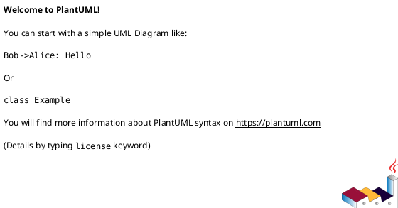
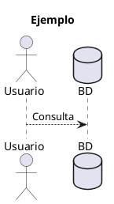

# Configuración de PlantUML en VS Code

**Fecha:** 2026-03-15
**Sistema:** Ubuntu 24.04
**VS Code:** Extensión Plan UML

---

## ✅ PROBLEMA RESUELTO

El error "Failed to generate SVG file" ocurría porque:
1. El archivo `relaciones.puml` estaba vacío
2. PlantUML JAR no estaba en la ubicación que espera VS Code

**Solución aplicada:**
- ✅ Creado diagrama completo en `relaciones.puml`
- ✅ Copiado PlantUML JAR a `~/.config/Code/User/globalStorage/justuskarlsson.plan-uml/`
- ✅ Verificado funcionamiento con comando de prueba

---

## 🔄 ACCIÓN REQUERIDA

**Debes recargar VS Code para que detecte los cambios:**

### Método 1: Recargar Window (Rápido)
```
1. Presionar: Ctrl + Shift + P
2. Escribir: "Reload Window"
3. Presionar Enter
```

### Método 2: Reiniciar VS Code
```
1. Cerrar VS Code completamente
2. Volver a abrir
```

---

## 📁 UBICACIONES DE ARCHIVOS

### PlantUML JAR (VS Code)
```
~/.config/Code/User/globalStorage/justuskarlsson.plan-uml/plantuml-1.2025.10.jar
```

### PlantUML JAR (Proyecto)
```
/home/uceda/Documents/ESPECIALIZACION/LAB 1/PRACTICA/plantuml.jar
```

### Archivos Temporales (VS Code)
```
~/.config/Code/User/globalStorage/justuskarlsson.plan-uml/plantuml-temp/
```

### Tu Diagrama
```
/home/uceda/Documents/ESPECIALIZACION/LAB 1/PRACTICA/relaciones.puml
```

---

## 🎨 CÓMO USAR PLANTUML EN VS CODE

### 1. Abrir Archivo
```
File → Open File → relaciones.puml
```

### 2. Ver Preview

**Opción A: Atajo de teclado**
```
Alt + D
```

**Opción B: Menú contextual**
```
Click derecho en el editor
→ "PlantUML: Preview Current Diagram"
```

**Opción C: Paleta de comandos**
```
Ctrl + Shift + P
→ "PlantUML: Preview Current Diagram"
```

### 3. Exportar Diagrama

**Click derecho en el editor:**
```
→ "PlantUML: Export Current Diagram"
→ Elegir formato (SVG, PNG, PDF)
```

**O usar paleta:**
```
Ctrl + Shift + P
→ "PlantUML: Export Current Diagram"
```

---

## ⚙️ CONFIGURACIÓN DE LA EXTENSIÓN

### Verificar Extensión Instalada

1. Presionar `Ctrl + Shift + X` (Extensions)
2. Buscar "PlantUML"
3. Debe aparecer **"PlantUML" de jebbs**
4. Estado: **Installed** (instalado)

Si no está instalada:
```
1. Extensions (Ctrl + Shift + X)
2. Buscar "PlantUML"
3. Instalar "PlantUML" de jebbs
4. Reload Window
```

### Configurar Manualmente (Si es necesario)

**Abrir Settings:**
```
File → Preferences → Settings
O presionar: Ctrl + ,
```

**Buscar:** `plantuml jar`

**Establecer ruta del JAR:**
```
/home/uceda/.config/Code/User/globalStorage/justuskarlsson.plan-uml/plantuml-1.2025.10.jar
```

**O en settings.json:**
```json
{
    "plantuml.jar": "/home/uceda/.config/Code/User/globalStorage/justuskarlsson.plan-uml/plantuml-1.2025.10.jar"
}
```

### Otras Configuraciones Útiles

**settings.json completo para PlantUML:**

```json
{
    // Ruta del JAR
    "plantuml.jar": "/home/uceda/.config/Code/User/globalStorage/justuskarlsson.plan-uml/plantuml-1.2025.10.jar",

    // Formato de exportación por defecto
    "plantuml.exportFormat": "svg",

    // Carpeta de exportación (por defecto: mismo directorio)
    "plantuml.exportOutDir": ".",

    // Tema
    "plantuml.render": "PlantUMLServer",

    // Pre-renderizado automático
    "plantuml.previewAutoUpdate": true,

    // Incluir código fuente en preview
    "plantuml.previewFileType": "svg"
}
```

**Para editar settings.json:**
```
Ctrl + Shift + P
→ "Preferences: Open User Settings (JSON)"
```

---

## 🐛 TROUBLESHOOTING

### Error: "Java is not available"

**Verificar Java:**
```bash
java -version
```

**Si no está instalado:**
```bash
sudo apt install default-jre
```

### Error: "Dot executable does not exist"

**Verificar Graphviz:**
```bash
dot -V
```

**Si no está instalado:**
```bash
sudo apt install graphviz
```

### Error: "Failed to generate SVG"

**1. Verificar que el archivo .puml no esté vacío:**
```bash
cat relaciones.puml
```

**2. Verificar sintaxis:**
```bash
cd "/home/uceda/Documents/ESPECIALIZACION/LAB 1/PRACTICA"
java -jar plantuml.jar -checkonly relaciones.puml
```

**3. Probar generar manualmente:**
```bash
java -jar plantuml.jar relaciones.puml -tsvg
```

### Preview no se actualiza

**Soluciones:**
1. Cerrar y reabrir el preview
2. Guardar el archivo (Ctrl + S)
3. Reload Window (Ctrl + Shift + P → Reload Window)

### Preview muestra error de rendering

**Verificar:**
1. Que el archivo tenga `@startuml` y `@enduml`
2. Que la sintaxis sea correcta
3. Que no haya caracteres especiales problemáticos

---

## 💡 TIPS Y TRUCOS

### 1. Split View con Preview

```
1. Abrir relaciones.puml
2. Presionar Alt + D (preview)
3. Arrastrar el preview a un lado
4. Ahora tienes código y preview lado a lado
```

### 2. Actualización Automática

La configuración `"plantuml.previewAutoUpdate": true` hace que el preview se actualice automáticamente al guardar.

### 3. Múltiples Diagramas en un Archivo



VS Code mostrará ambos en el preview.

### 4. Snippets

Instala la extensión "PlantUML Snippets" para autocompletar:
```
Extensions → Buscar "PlantUML Snippets"
```

### 5. Zoom en Preview

```
Ctrl + Scroll (rueda del mouse)
O
Ctrl + + / Ctrl + -
```

---

## 🔄 ALTERNATIVA: USAR TERMINAL

Si prefieres no usar VS Code para generar diagramas:

**Script conveniente:**
```bash
cd "/home/uceda/Documents/ESPECIALIZACION/LAB 1/PRACTICA"
./generar_diagrama.sh relaciones.puml svg
```

**Manual:**
```bash
java -jar plantuml.jar relaciones.puml -tsvg
xdg-open "Arquitectura de Red - Práctica KVM.svg"
```

**Ventajas:**
- ✅ Más rápido
- ✅ No depende de VS Code
- ✅ Fácil de automatizar

---

## 📊 COMPARACIÓN: VS Code vs Terminal

| Característica | VS Code | Terminal |
|----------------|---------|----------|
| **Preview en vivo** | ✅ Sí | ❌ No |
| **Autocompletado** | ✅ Sí (con extensión) | ❌ No |
| **Velocidad** | ⚠️ Media | ✅ Rápida |
| **Exportar múltiples formatos** | ✅ Fácil | ⚠️ Manual |
| **Portabilidad** | ⚠️ Requiere VS Code | ✅ Solo Java |
| **Automatización** | ❌ Limitada | ✅ Scripts |

**Recomendación:**
- **Desarrollo/edición:** Usa VS Code con preview
- **Generación final:** Usa terminal/script

---

## 🎨 EXTENSIONES COMPLEMENTARIAS

### PlantUML (jebbs) - PRINCIPAL ✨
```
ID: jebbs.plantuml
Función: Renderizado y preview de diagramas
Estado: ✅ Debe estar instalada
```

### PlantUML Snippets (opcional)
```
ID: danielr.plantuml-snippets
Función: Autocompletado y snippets
```

### PlantUML Syntax (opcional)
```
ID: qjebbs.plantuml-syntax
Función: Mejor resaltado de sintaxis
```

### Markdown Preview Enhanced (complementaria)
```
ID: shd101wyy.markdown-preview-enhanced
Función: Preview de markdown con PlantUML embebido
```

**Instalar extensiones:**
```
Ctrl + Shift + X
→ Buscar nombre de la extensión
→ Install
```

---

## 📝 EJEMPLO DE WORKFLOW

### 1. Crear Nuevo Diagrama

```bash
cd "/home/uceda/Documents/ESPECIALIZACION/LAB 1/PRACTICA"
code nuevo_diagrama.puml
```

### 2. Escribir Código PlantUML



### 3. Ver Preview

```
Alt + D
```

### 4. Iterar

```
Editar código → Guardar (Ctrl + S) → Preview se actualiza
```

### 5. Exportar

```
Click derecho → Export Current Diagram → SVG
```

---

## ⚡ SHORTCUTS ÚTILES

| Atajo | Acción |
|-------|--------|
| `Alt + D` | Preview del diagrama |
| `Ctrl + S` | Guardar (actualiza preview) |
| `Ctrl + Shift + P` | Paleta de comandos |
| `Ctrl + ,` | Abrir Settings |
| `Ctrl + Shift + X` | Extensions |
| `Ctrl + Shift+ E` | Explorer |
| `F1` | Paleta de comandos (alternativa) |

---

## 🔍 VERIFICACIÓN POST-CONFIGURACIÓN

Ejecuta estos pasos para verificar que todo funciona:

### 1. Verificar Java
```bash
java -version
# Debería mostrar: openjdk version "21.0.10"
```

### 2. Verificar Graphviz
```bash
dot -V
# Debería mostrar: dot - graphviz version 2.43.0
```

### 3. Verificar PlantUML JAR
```bash
ls -lh ~/.config/Code/User/globalStorage/justuskarlsson.plan-uml/plantuml-1.2025.10.jar
# Debería existir (25M)
```

### 4. Probar Generación
```bash
cd "/home/uceda/Documents/ESPECIALIZACION/LAB 1/PRACTICA"
java -jar plantuml.jar relaciones.puml -tsvg
# Debería generar SVG sin errores
```

### 5. Verificar en VS Code
```
1. Abrir VS Code
2. Reload Window (Ctrl + Shift + P)
3. Abrir relaciones.puml
4. Alt + D (debería mostrar preview) ✓
```

---

## 📚 RECURSOS

### Documentación
- **PlantUML oficial:** https://plantuml.com/
- **Extensión VS Code:** https://marketplace.visualstudio.com/items?itemName=jebbs.plantuml

### Tutoriales
- **Guía completa:** `GUIA_PLANTUML.md` (en tu proyecto)
- **Ejemplos:** https://real-world-plantuml.com/

### Ayuda
```bash
# Ayuda de PlantUML
java -jar plantuml.jar -help

# Listar temas
java -jar plantuml.jar -theme
```

---

## ✅ CHECKLIST FINAL

- [x] Java 21 instalado
- [x] Graphviz instalado
- [x] PlantUML JAR en ubicación VS Code
- [x] PlantUML JAR en proyecto
- [x] Diagrama relaciones.puml creado
- [x] SVG de prueba generado
- [x] Extensión PlantUML instalada
- [ ] **VS Code recargado** ← HACER ESTO
- [ ] **Preview funcionando** ← Verificar después de recargar

---

**Archivo:** `CONFIGURACION_VSCODE_PLANTUML.md`
**Ubicación:** `/home/uceda/Documents/ESPECIALIZACION/LAB 1/PRACTICA/`
**Última actualización:** 2026-03-15 19:40
