# Guía Completa de PlantUML

**Fecha:** 2026-03-15
**Sistema:** Ubuntu 24.04

---

## ✅ PROBLEMA RESUELTO

El error que tenías era porque el archivo `relaciones.puml` estaba **vacío**. PlantUML no puede generar imágenes de archivos vacíos.

### Estado Actual

✅ **Java 21** instalado
✅ **Graphviz** instalado
✅ **PlantUML JAR** descargado (plantuml.jar)
✅ **Diagrama de ejemplo** creado (relaciones.puml)
✅ **SVG generado** correctamente

---

## 📁 Archivos Creados

```
/home/uceda/Documents/ESPECIALIZACION/LAB 1/PRACTICA/
├── relaciones.puml                              ← Código fuente del diagrama
├── Arquitectura de Red - Práctica KVM.svg      ← Imagen generada
└── plantuml.jar                                ← PlantUML ejecutable
```

---

## 🎨 ¿Qué es PlantUML?

**PlantUML** es una herramienta que permite crear diagramas UML usando código de texto plano.

### Ventajas

- ✅ Diagramas como código (versionables con Git)
- ✅ Fácil de modificar
- ✅ Genera imágenes automáticamente (SVG, PNG, PDF)
- ✅ Integración con VS Code, Markdown, etc.
- ✅ Gratis y Open Source

### Tipos de Diagramas Soportados

- **Diagramas de secuencia**
- **Diagramas de casos de uso**
- **Diagramas de clases**
- **Diagramas de componentes**
- **Diagramas de despliegue**
- **Diagramas de red**
- **Diagramas de actividad**
- **Diagramas de estado**
- **Y muchos más...**

---

## 🚀 CÓMO USAR PLANTUML

### Opción 1: Desde la Terminal

```bash
# Ir a la carpeta donde está el archivo .puml
cd "/home/uceda/Documents/ESPECIALIZACION/LAB 1/PRACTICA"

# Generar SVG
java -jar plantuml.jar relaciones.puml -tsvg

# Generar PNG
java -jar plantuml.jar relaciones.puml -tpng

# Generar PDF
java -jar plantuml.jar relaciones.puml -tpdf
```

### Opción 2: Desde VS Code

1. **Instalar extensión PlantUML:**
   - Abrir VS Code
   - Ir a Extensions (Ctrl+Shift+X)
   - Buscar "PlantUML"
   - Instalar "PlantUML" de jebbs

2. **Ver preview:**
   - Abrir archivo `.puml`
   - Presionar `Alt + D` (preview)
   - O hacer clic derecho → "PlantUML: Preview Current Diagram"

3. **Exportar:**
   - Hacer clic derecho en el archivo `.puml`
   - "PlantUML: Export Current Diagram"
   - Elegir formato (SVG, PNG, PDF)

### Opción 3: Generar Todos los Diagramas

```bash
cd "/home/uceda/Documents/ESPECIALIZACION/LAB 1/PRACTICA"

# Generar todos los archivos .puml en la carpeta
java -jar plantuml.jar *.puml -tsvg
```

---

## 📝 SINTAXIS BÁSICA DE PLANTUML

### Estructura Básica

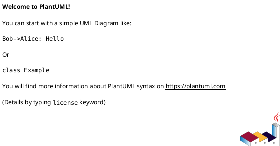

**Importante:**
- Siempre debe empezar con `@startuml`
- Siempre debe terminar con `@enduml`
- Los comentarios se escriben con `'` (comilla simple)

### Ejemplo 1: Diagrama Simple

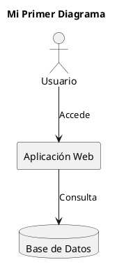

### Ejemplo 2: Diagrama de Red (Como el que creamos)

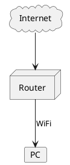

### Ejemplo 3: Diagrama de Secuencia

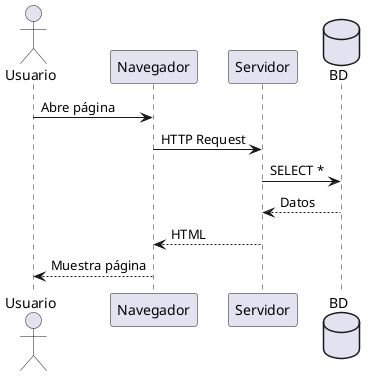

---

## 🎨 ELEMENTOS COMUNES

### Nodos y Objetos

```plantuml
actor Usuario
agent Agente
artifact Artefacto
boundary Frontera
card Tarjeta
cloud Nube
component Componente
control Control
database BaseDatos
entity Entidad
file Archivo
folder Carpeta
frame Marco
interface Interfaz
node Nodo
package Paquete
queue Cola
stack Pila
rectangle Rectángulo
storage Almacenamiento
usecase CasoDeUso
```

### Colores

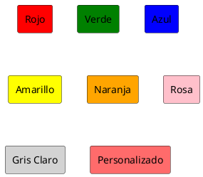

### Tipos de Flechas

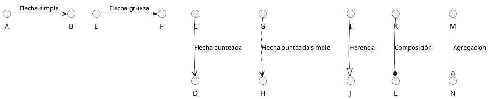

### Notas

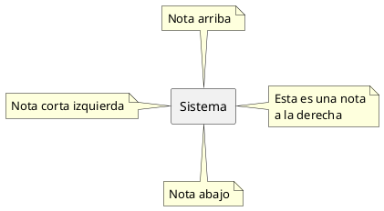

---

## 🔧 COMANDOS ÚTILES

### Generar Diagrama

```bash
# SVG (recomendado para web)
java -jar plantuml.jar archivo.puml -tsvg

# PNG (para documentos)
java -jar plantuml.jar archivo.puml -tpng

# PDF
java -jar plantuml.jar archivo.puml -tpdf

# Múltiples formatos
java -jar plantuml.jar archivo.puml -tsvg -tpng
```

### Ver Versión

```bash
java -jar plantuml.jar -version
```

### Verificar Sintaxis

```bash
java -jar plantuml.jar -checkonly archivo.puml
```

### Generar con Nombre Específico

Si quieres que el archivo de salida tenga un nombre específico (no el título), usa:

```bash
java -jar plantuml.jar archivo.puml -tsvg -o salida.svg
```

---

## 📋 EJEMPLO COMPLETO: Tu Arquitectura de Red

Archivo: `relaciones.puml`

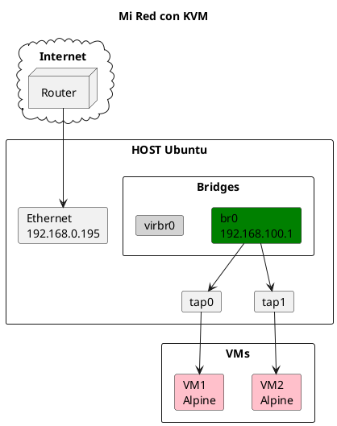

**Generar:**
```bash
java -jar plantuml.jar relaciones.puml -tsvg
```

---

## 🎨 TEMAS Y ESTILOS

### Aplicar Tema

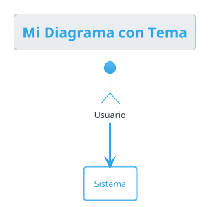

### Temas Disponibles

- `cerulean` - Azul moderno
- `bluegray` - Azul grisáceo
- `plain` - Minimalista
- `sketchy` - Estilo dibujado a mano
- `vibrant` - Colores vibrantes
- `mars` - Tonos rojizos
- `united` - Profesional

### Skinparam (Personalización)

```plantuml
@startuml

skinparam backgroundColor #FEFEFE
skinparam componentStyle rectangle
skinparam shadowing false
skinparam handwritten true

rectangle "Componente" #LightBlue

@enduml
```

---

## 🖼️ VER TUS DIAGRAMAS

### Opción 1: Navegador Web

```bash
# Abrir el SVG generado en el navegador
firefox "Arquitectura de Red - Práctica KVM.svg"
# O
google-chrome "Arquitectura de Red - Práctica KVM.svg"
```

### Opción 2: Visor de Imágenes

```bash
# Abrir con visor predeterminado
xdg-open "Arquitectura de Red - Práctica KVM.svg"
```

### Opción 3: VS Code

```bash
# Abrir en VS Code
code "Arquitectura de Red - Práctica KVM.svg"
```

### Opción 4: Incrustar en Markdown

En un archivo `.md`:

```markdown

```

---

## 🔄 WORKFLOW RECOMENDADO

### 1. Crear/Editar Diagrama

```bash
code relaciones.puml
```

### 2. Generar Imagen

```bash
java -jar plantuml.jar relaciones.puml -tsvg
```

### 3. Ver Resultado

```bash
xdg-open "Arquitectura de Red - Práctica KVM.svg"
```

### 4. Iterar

Repite los pasos 1-3 hasta que el diagrama esté perfecto.

---

## 🐛 TROUBLESHOOTING

### Error: "no image in archivo.puml"

**Causa:** El archivo está vacío o tiene sintaxis incorrecta.

**Solución:**
1. Verificar que el archivo tiene `@startuml` y `@enduml`
2. Verificar sintaxis con:
   ```bash
   java -jar plantuml.jar -checkonly archivo.puml
   ```

### Error: "Dot executable does not exist"

**Causa:** Graphviz no está instalado.

**Solución:**
```bash
sudo apt install graphviz
```

### Error: "Java not found"

**Causa:** Java no está instalado.

**Solución:**
```bash
sudo apt install default-jre
```

### El SVG tiene nombre raro

**Causa:** PlantUML usa el título del diagrama como nombre de archivo.

**Soluciones:**
1. Cambiar el título en el archivo `.puml`
2. Renombrar el archivo después:
   ```bash
   mv "Arquitectura de Red - Práctica KVM.svg" diagrama.svg
   ```
3. No usar `title` en el diagrama

---

## 📚 RECURSOS ADICIONALES

### Documentación Oficial

- **Sitio web:** https://plantuml.com/
- **Guía completa:** https://plantuml.com/guide
- **Galería de ejemplos:** https://real-world-plantuml.com/

### Editores Online

- **PlantUML Online Server:** http://www.plantuml.com/plantuml/uml/
- **PlantText:** https://www.planttext.com/

### Comandos de Ayuda

```bash
# Ver ayuda general
java -jar plantuml.jar -help

# Ver opciones avanzadas
java -jar plantuml.jar -h

# Listar temas disponibles
java -jar plantuml.jar -theme
```

---

## 💡 TIPS Y TRUCOS

### 1. Guardar Configuración de Colores

Crear archivo `config.puml`:

```plantuml
!define COLOR_FISICO #Orange
!define COLOR_VIRTUAL #Green
!define COLOR_VM #Pink
```

Usar en otros diagramas:

```plantuml
@startuml
!include config.puml

card "Ethernet" COLOR_FISICO
card "br0" COLOR_VIRTUAL
card "VM1" COLOR_VM

@enduml
```

### 2. Diagramas Complejos

Para diagramas grandes, separar en bloques:

```plantuml
@startuml

' Bloque 1: Definiciones
rectangle "Sistema A" as sysA
rectangle "Sistema B" as sysB

' Bloque 2: Relaciones
sysA --> sysB

@enduml
```

### 3. Ocultar Relaciones

```plantuml
' Ocultar relación pero mantener posición
A -[hidden]-> B
```

### 4. Leyendas

```plantuml
legend bottom
    |= Color |= Significado |
    | <back:Green>   </back> | Activo |
    | <back:Gray>   </back> | Inactivo |
endlegend
```

---

## 🎯 TU DIAGRAMA ACTUAL

Tu diagrama `relaciones.puml` contiene:

- ✅ Arquitectura de red completa
- ✅ Host con interfaces físicas
- ✅ Bridges virtuales
- ✅ Interfaces TAP
- ✅ Máquinas virtuales
- ✅ Notas explicativas
- ✅ Leyenda con colores
- ✅ Tema cerulean aplicado

**Para verlo:**

```bash
cd "/home/uceda/Documents/ESPECIALIZACION/LAB 1/PRACTICA"
xdg-open "Arquitectura de Red - Práctica KVM.svg"
```

**Para editarlo:**

```bash
code relaciones.puml
```

Después de editar, regenera:

```bash
java -jar plantuml.jar relaciones.puml -tsvg
```

---

## 📝 SCRIPT ÚTIL

Guarda esto como `generar_diagrama.sh`:

```bash
#!/bin/bash
# Script para generar diagramas PlantUML

ARCHIVO="$1"
FORMATO="${2:-svg}"

if [ -z "$ARCHIVO" ]; then
    echo "Uso: $0 <archivo.puml> [formato]"
    echo "Formatos: svg, png, pdf"
    exit 1
fi

java -jar plantuml.jar "$ARCHIVO" -t$FORMATO

echo "✓ Diagrama generado en formato $FORMATO"
ls -lh *.${FORMATO} | tail -1
```

**Uso:**

```bash
chmod +x generar_diagrama.sh
./generar_diagrama.sh relaciones.puml svg
```

---

**Archivo:** `GUIA_PLANTUML.md`
**Ubicación:** `/home/uceda/Documents/ESPECIALIZACION/LAB 1/PRACTICA/`
**Última actualización:** 2026-03-15 19:30
