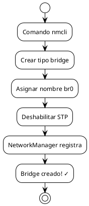
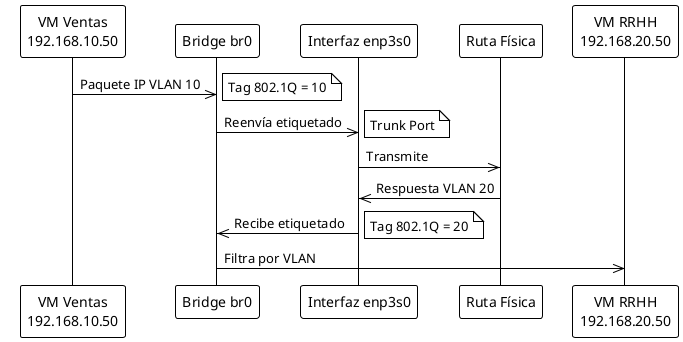
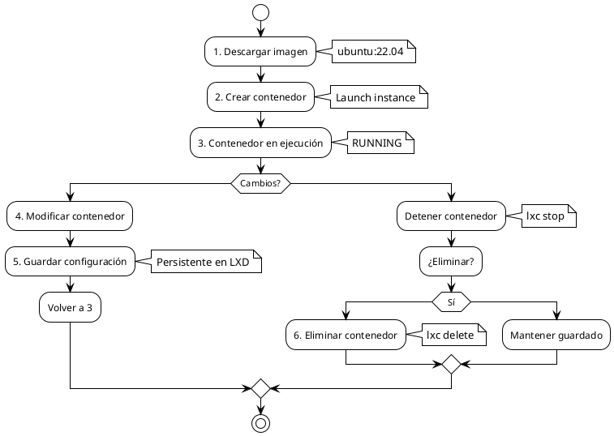
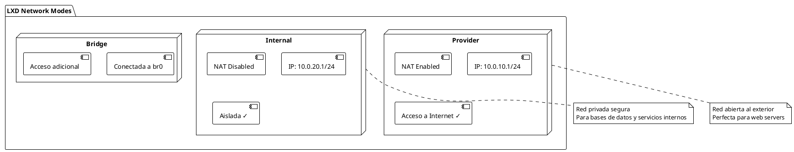
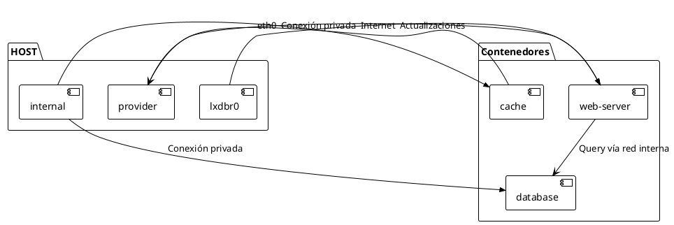
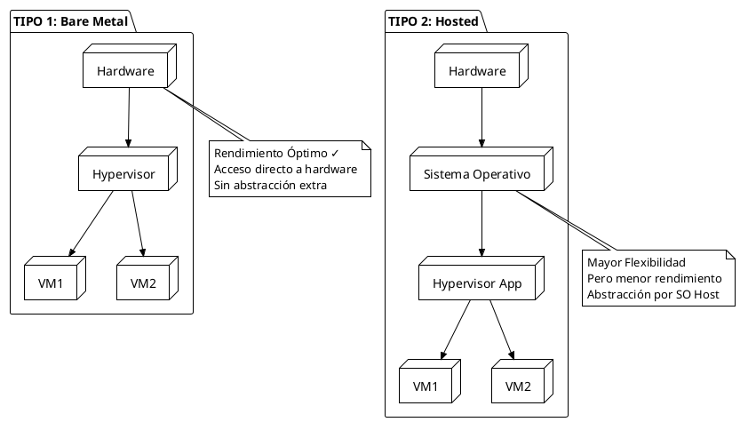
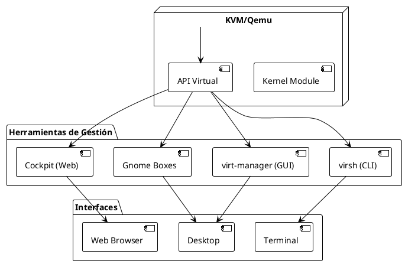
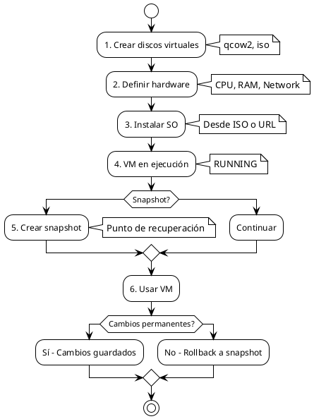
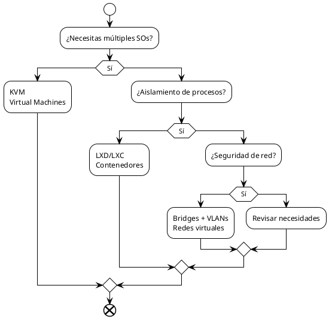
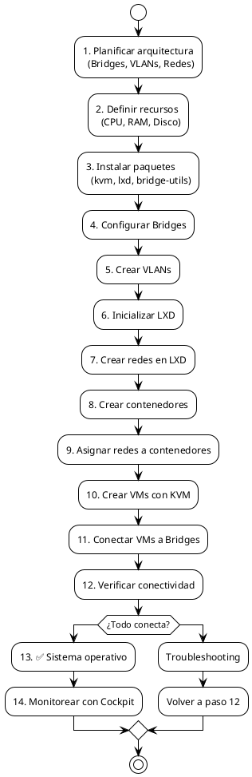

# 📚 Guías de Virtualización y Contenedores Linux - Consolidadas

**Universidad de El Salvador**  
Facultad de Ingeniería y Arquitectura  
Escuela de Ingeniería de Sistemas Informáticos

---

## 📋 Índice General

1. [Resumen Ejecutivo](#resumen-ejecutivo)
2. [Horario de Aprendizaje](#horario-de-aprendizaje)
3. [Diagrama General de Arquitectura](#diagrama-general)
4. [Guía 1: Bridges, VLANs y NetworkManager](#guía-1-bridges-vlans-y-networkmanager)
5. [Guía 2: Contenedores Linux LXD/LXC](#guía-2-contenedores-linux-lxdlxc)
6. [Guía 3: KVM - Máquinas Virtuales](#guía-3-kvm---máquinas-virtuales)
7. [Matriz Comparativa](#matriz-comparativa)
8. [Conclusiones](#conclusiones)

---

## 🎯 Resumen Ejecutivo

Estas tres guías complementarias cubren las principales tecnologías de **virtualización y contenedores** en Linux, permitiendo a los desarrolladores:

- **Bridge & VLAN**: Crear infraestructuras de red virtuales con aislamiento mediante VLANs
- **LXD/LXC**: Desplegar contenedores Linux ligeros y permanentes
- **KVM**: Ejecutar máquinas virtuales completas en un hipervisor tipo 1

```
┌─────────────────────────────────────────────────────────────┐
│         ECOSISTEMA DE VIRTUALIZACIÓN LINUX                   │
├─────────────────────────────────────────────────────────────┤
│                                                               │
│  🌐 CAPA DE RED         → Bridges, VLANs, NetworkManager     │
│  📦 CAPA DE CONTENEDORES → LXD/LXC                           │
│  💻 CAPA DE VMs         → KVM (Hipervisor Tipo 1)            │
│  ⚙️  HARDWARE           → CPU, RAM, Disco                    │
│                                                               │
└─────────────────────────────────────────────────────────────┘
```

---

## ⏰ Horario de Aprendizaje

### Plan de Capacitación Sugerido (40 horas)

| # | Módulo | Duración | Horas | Sesiones | Requisitos |
|---|--------|----------|-------|----------|-----------|
| 1 | **Introducción a Virtualización** | 1 día | 8h | 2 × 4h | Acceso a Linux |
| 2 | **NetworkManager & Bridges** | 2 días | 16h | 4 × 4h | Módulo 1 |
| 3 | **Configuración de VLANs** | 1 día | 8h | 2 × 4h | Módulo 2 |
| 4 | **LXD/LXC Contenedores** | 2 días | 16h | 4 × 4h | Módulo 1 |
| 5 | **KVM y Máquinas Virtuales** | 2 días | 16h | 4 × 4h | Módulo 1 |
| 6 | **Proyecto Integrador** | 2 días | 16h | 4 × 4h | Módulos 2-5 |
| | **TOTAL** | **10 días** | **80h** | **20 sesiones** | |

### Horario Diario Recomendado

```
09:00 - 10:30  │ Teoría & Conceptos
10:30 - 10:45  │ Descanso ☕
10:45 - 12:30  │ Práctica Guiada
12:30 - 13:30  │ Almuerzo 🍽️
13:30 - 15:00  │ Ejercicios Prácticos
15:00 - 15:15  │ Descanso
15:15 - 16:45  │ Laboratorio Libre
16:45 - 17:00  │ Revisión & Preguntas
```

---

## 📊 Diagrama General

### Arquitectura Completa de Infra Virtual en Linux

```puml
@startuml architecture_overview
!theme plain

package "Hardware Físico" {
  component CPU
  component RAM
  component Disk
  component NIC["Tarjeta de Red"]
}

package "Kernel Linux" {
  component KVM["KVM Module"]
  component NM["NetworkManager"]
  component LXC["LXC Runtime"]
  component VLAN["802.1Q Support"]
}

package "Bridging Layer" {
  component BR0["Bridge br0"]
  component BR1["Bridge br1"]
}

package "Contenedores & VMs" {
  component Container1["Container Ubuntu"]
  component Container2["Container Debian"]
  component VM1["VM Windows"]
  component VM2["VM macOS"]
}

package "Redes Virtuales" {
  component VLAN10["VLAN 10: Ventas"]
  component VLAN20["VLAN 20: RRHH"]
  component Provider["Red Provider (NAT)"]
  component Internal["Red Internal"]
}

CPU --> KVM
RAM --> KVM
Disk --> KVM
NIC --> NM

NM --> BR0
NM --> BR1
NM --> VLAN

BR0 --> Container1
BR0 --> Container2
BR0 --> VM1

BR1 --> VM2

VLAN10 --> VLAN
VLAN20 --> VLAN

Provider --> Container1
Internal --> Container2

@enduml
```

---

## 🔧 GUÍA 1: Bridges, VLANs y NetworkManager

### 1.1 Contexto y Propósito

**Objetivo**: Crear puentes de red (bridges) que permitan que máquinas virtuales y contenedores se comuniquen como si estuvieran conectadas a un switch físico, incluyendo soporte para VLANs (Virtual LANs).

**Casos de Uso**:
- Máquinas virtuales necesitan conectarse a la misma red que el host
- Múltiples VLANs atraviesan una única interfaz física
- Necesidad de aislar tráfico de red entre diferentes departamentos

### 1.2 Conceptos Clave

```puml
@startuml bridge_concept
!theme plain

actor Host["Host Linux"]
participant "Bridge br0"
participant "Interfaz Física\nenp0s1"
participant "VM 1"
participant "VM 2"
participant "Contenedor"

Host --> "Bridge br0": Gestiona
"Bridge br0" --> "Interfaz Física\nenp0s1": Controla
"Interfaz Física\nenp0s1" --> "VM 1": Conecta
"Interfaz Física\nenp0s1" --> "VM 2": Conecta
"Interfaz Física\nenp0s1" --> "Contenedor": Conecta

note right of "Bridge br0"
  Actúa como un Switch L2
  Filtra tramas L2
  Soporta VLAN 802.1Q
end note

@enduml
```

### 1.3 Proceso Paso a Paso

#### **Paso 1: Instalación de Paquetes**

```bash
sudo apt install bridge-utils qemu-kvm libvirt-daemon-system vlan tcpdump
```

| Paquete | Función |
|---------|---------|
| `bridge-utils` | Herramientas de bridge (deprecated pero útiles para diagnostico) |
| `qemu-kvm` | Emulador KVM para VMs |
| `libvirt-daemon-system` | Daemon de virtualización |
| `vlan` | Módulo 802.1Q para VLANs |
| `tcpdump` | Captura y análisis de tráfico |

#### **Paso 2: Crear Bridge br0**

```bash
sudo nmcli connection add type bridge ifname br0 stp no
```

**Parámetros**:
- `type bridge`: Tipo de conexión puente
- `ifname br0`: Nombre de la interfaz
- `stp no`: Spanning Tree Protocol deshabilitado



#### **Paso 3: Vincular Interfaz Física**

```bash
sudo nmcli con add type bridge-slave ifname enp0s1 master br0
```

**Resultado**: La interfaz física `enp0s1` ahora es esclava del bridge `br0`

```
Antes:
  enp0s1 → Internet

Después:
  enp0s1 → br0 → [VM1, VM2, Containers]
         ↘ Internet
```

#### **Paso 4: Activar Bridge**

```bash
sudo nmcli con up br0
sudo nmcli con up bridge-slave-enp0s1
```

#### **Paso 5: Verificación**

```bash
nmcli con show br0
nmcli con show --active | grep bridge
ip addr show br0
bridge link show br0
bridge fdb show dev br0
```

### 1.4 Configuración de VLANs

#### **1.4.1 Crear Bridge con soporte VLAN**

```bash
sudo nmcli con add type bridge con-name br0 ifname br0
sudo nmcli con mod br0 bridge.vlan-filtering yes
```

#### **1.4.2 Agregar Interfaz Física**

```bash
sudo nmcli con add type bridge-slave con-name br0-port1 ifname enp3s0 master br0
```

#### **1.4.3 Configurar Modo Trunk**

```bash
# Permitir VLANs 10 y 20 a través del bridge
sudo nmcli con mod br0 +bridge.vlans "10, 20"
```

#### **1.4.4 Arquitectura VLAN**

```puml
@startuml vlan_architecture
!theme plain

package "Host" {
  component BR0["Bridge br0"]
  component VLAN10["VLAN 10 Interface"]
  component VLAN20["VLAN 20 Interface"]
  component enp3s0["enp3s0 (Trunk)"]
}

package "VM 1 (Ventas)" {
  component VM1_eth0["eth0"]
  component VM1_vlan10["vlan.10: 192.168.10.50/24"]
}

package "VM 2 (RRHH)" {
  component VM2_eth0["eth0"]
  component VM2_vlan20["vlan.20: 192.168.20.50/24"]
}

BR0 --> enp3s0: Trunk Port
BR0 --> VLAN10
BR0 --> VLAN20

VLAN10 --> VM1_vlan10
VLAN20 --> VM2_vlan20

@enduml
```

### 1.5 Configuración de VM con Bridge

#### Método A: Gráfico (virt-manager)

1. Abrir `virt-manager`
2. Seleccionar VM → Mostrar detalles hardware
3. NIC → Red → "Bridge device"
4. Dispositivo: `br0`
5. Modelo: `virtio`
6. Aplicar y reiniciar

#### Método B: XML (virsh)

```xml
<interface type='bridge'>
  <mac address='52:54:00:ee:44:11'/>
  <source bridge='br0'/>
  <model type='virtio'/>
</interface>
```

### 1.6 Configuración VLAN en VM (Netplan)

**Archivo**: `/etc/netplan/01-vlan-config.yaml`

```yaml
network:
  version: 2
  renderer: networkd
  ethernets:
    # Interfaz física de la VM (conectada al Bridge del host)
    enp0s3:
      dhcp4: no
      up: true

  vlans:
    # VLAN 10 - Ventas
    vlan10:
      id: 10
      link: enp0s3
      addresses:
        - 192.168.10.50/24
      nameservers:
        addresses: [8.8.8.8, 1.1.1.1]

    # VLAN 20 - RRHH
    vlan20:
      id: 20
      link: enp0s3
      addresses:
        - 192.168.20.50/24
```

### 1.7 Flujo de Tráfico VLAN



### 1.8 Tabla de Referencia de Comandos

| Comando | Descripción |
|---------|------------|
| `sudo nmcli connection add type bridge ifname br0 stp no` | Crear bridge br0 |
| `sudo nmcli con add type bridge-slave ifname enp0s1 master br0` | Vincular interfaz física |
| `sudo nmcli con up br0` | Activar bridge |
| `nmcli con show br0` | Mostrar detalles del bridge |
| `sudo nmcli con mod br0 bridge.vlan-filtering yes` | Habilitar filtrado VLAN |
| `sudo nmcli con mod br0 +bridge.vlans "10, 20"` | Agregar VLANs |
| `ip addr show br0` | Ver IP del bridge |
| `bridge link show br0` | Ver puertos del bridge |
| `bridge fdb show dev br0` | Ver tabla MAC del bridge |
| `sudo modprobe 8021q` | Cargar módulo 802.1Q |

---

## 📦 GUÍA 2: Contenedores Linux LXD/LXC

### 2.1 Contexto

**Diferencia**: Los contenedores **LXC** son permanentes (cambios se guardan). Los contenedores **Docker** son efímeros (requieren reconstrucción para cambios).

**Ventajas de LXD/LXC**:
- ✅ Contenedores persistentes como VM ligeras
- ✅ Ocupan menos recursos que VMs completas
- ✅ Acceso completo a directorios del sistema
- ✅ Cluster centralizado con LXD
- ✅ Redes privadas internas

### 2.2 Instalación

```bash
# Actualizar repositorios
sudo apt update

# Instalar snapd (si no está presente)
sudo apt install snapd

# Instalar LXD
sudo snap install lxd

# Configuración inicial (automática)
lxd init --minimal
```

### 2.3 Ciclo de Vida de Contenedores



### 2.4 Operaciones Básicas de Contenedores

#### **Listar Imágenes Disponibles**

```bash
# Imágenes de Ubuntu
lxc image list ubuntu:

# Todas las imágenes
lxc image list images:

# Repositorio completo
# https://images.linuxcontainers.org/
```

#### **Crear Contenedor Básico**

```bash
lxc launch ubuntu:22.04 controller
```

**Resultado**:
```
Creating the instance...
Retrieving the image: ubuntu 22.04 LTS
Starting the instance...
```

#### **Crear con Limitaciones de Recursos**

```bash
lxc launch ubuntu:22.04 controller \
  --config limits.cpu=1 \
  --config limits.memory=1024MiB
```

| Parámetro | Valor | Descripción |
|-----------|-------|------------|
| `limits.cpu` | 1 | 1 núcleo de CPU |
| `limits.memory` | 1024MiB | 1 GB de RAM |
| `limits.disk` | 10GiB | 10 GB de almacenamiento |

#### **Crear Contenedor como VM (QEMU)**

```bash
lxc launch images:debian/12 debian-vm \
  --vm \
  --device root,size=20GiB
```

**Ventaja**: Comportamiento de VM completa pero con menos overhead

#### **Listar Contenedores**

```bash
lxc list
```

**Salida**:
```
+-----------+---------+-----IP-----+-------IPV6-------+------TYPE------+
|   NAME    |  STATE  |   IPV4     |       IPV6        |      TYPE       |
+-----------+---------+-----IP-----+-------IPV6-------+------TYPE------+
| controller| RUNNING | 10.140.60.5| fd42::1 (eth0)    | CONTAINER       |
+-----------+---------+-----IP-----+-------IPV6-------+------TYPE------+
```

#### **Controlar Contenedores**

```bash
# Iniciar
lxc start controller

# Detener
lxc stop controller

# Reiniciar
lxc restart controller

# Eliminar
lxc delete controller
```

#### **Acceder a la Consola**

```bash
lxc exec controller -- bash
```

O con comando específico:

```bash
lxc exec controller -- apt update
lxc exec controller -- apt install -y nginx
```

### 2.5 Redes en LXD

#### **2.5.1 Tipos de Redes**



#### **2.5.2 Crear Redes**

```bash
# Red PROVIDER (con NAT e Internet)
lxc network create provider \
  ipv6.address=none \
  ipv4.address=10.0.10.1/24 \
  ipv4.nat=true

# Red INTERNAL (sin Internet)
lxc network create internal \
  ipv6.address=none \
  ipv4.address=10.0.20.1/24 \
  ipv4.nat=false
```

#### **2.5.3 Verificar Redes**

```bash
ip a
```

**Salida esperada**:
```
15: internal: <NO-CARRIER,BROADCAST,MULTICAST,UP> mtu 1500
    inet 10.0.20.1/24 scope global internal

28: provider: <NO-CARRIER,BROADCAST,MULTICAST,UP> mtu 1500
    inet 10.0.10.1/24 scope global provider
```

#### **2.5.4 Asignar Interfaces de Red a Contenedores**

```bash
# Interfaz CON acceso a Internet
lxc config device add controller eth0 nic \
  name=eth0 \
  nictype=bridged \
  parent=provider \
  ipv4.address=10.0.10.11/24

# Interfaz SIN acceso a Internet
lxc config device add controller eth1 nic \
  name=eth0 \
  nictype=bridged \
  parent=internal \
  ipv4.address=10.0.20.11/24
```

**Nota**: Reiniciar contenedor para que cambios tomen efecto

```bash
lxc restart controller
```

### 2.6 Topología de Red LXD



### 2.7 Matriz de Configuración de Contenedores

| Escenario | Red | CPU | RAM | Uso |
|-----------|-----|-----|-----|-----|
| Web Server | provider | 2 | 2GiB | Frontend público |
| Base Datos | internal | 4 | 4GiB | Datos privados |
| Cache Redis | internal | 1 | 512MiB | Servidor APPs |
| DNS | provider | 1 | 256MiB | Resolver DNS |

### 2.8 Tabla de Comandos LXD

| Comando | Descripción |
|---------|------------|
| `lxc launch ubuntu:22.04 mycontainer` | Crear y lanzar contenedor |
| `lxc list` | Listar todos los contenedores |
| `lxc info mycontainer` | Detalles del contenedor |
| `lxc start/stop/restart mycontainer` | Control de estado |
| `lxc exec mycontainer -- bash` | Entrar a consola |
| `lxc file push file.txt mycontainer/root/` | Enviar archivo |
| `lxc file pull mycontainer/file.txt ./` | Recibir archivo |
| `lxc network create red_name` | Crear red |
| `lxc network list` | Listar redes |
| `lxc config device add ...` | Asignar interfaz de red |

---

## 💻 GUÍA 3: KVM - Máquinas Virtuales

### 3.1 Conceptos de Hipervisores



| Característica | Tipo 1 | Tipo 2 |
|---|---|---|
| **Rendimiento** | ⭐⭐⭐⭐⭐ Optimizado | ⭐⭐⭐ Aceptable |
| **Overhead** | Mínimo | Significativo |
| **Complejidad** | Alta | Baja |
| **Uso** | Servidores datacenter | Desktop/Laboratorio |
| **Ejemplo** | KVM, Xen, vSphere | VirtualBox, Hyper-V |

### 3.2 KVM - Kernel-based Virtual Machine

**Definición**: Módulo integrado en el kernel de Linux que permite virtualización de máquinas virtuales completas.

**Características**:
- ✅ Parte del kernel desde v2.6.20 (2006)
- ✅ Tipo 1: Acceso directo a hardware
- ✅ Open Source
- ✅ Excelente rendimiento
- ✅ Soporte para múltiples huéspedes

### 3.3 Instalación de KVM

```bash
# Instalar paquetes
sudo apt install -y \
  bridge-utils \
  cpu-checker \
  libvirt-clients \
  libvirt-daemon \
  qemu-system \
  qemu-kvm

# Verificar soporte de CPU
kvm-ok

# Resultado esperado:
# INFO: /dev/kvm exists
# INFO: KVM acceleration can be used
```

### 3.4 Herramientas de Gestión KVM



### 3.5 Herramientas Disponibles

#### **A. Virtual Machine Manager (GUI)**

```bash
sudo apt install virt-manager
```

**Características**:
- Interfaz gráfica amigable
- Gestión visual de VMs
- Fácil configuración de hardware
- Ideal para principiantes

**Comando de referencia**:
```bash
virt-manager
```

#### **B. Gnome Boxes (GUI Simple)**

```bash
sudo apt install gnome-boxes
```

**Características**:
- Interfaz ultra simplificada
- Descarga automática de imágenes
- Perfecta para usuarios desktop
- Ideal para pruebas rápidas

#### **C. Cockpit (Web Console)**

```bash
# Instalar
sudo apt update
sudo apt install cockpit cockpit-machines -y

# Soporte para contenedores
sudo apt install cockpit-podman -y

# Permitir acceso remoto
sudo ufw allow 9090/tcp
```

**Acceso**:
```
https://localhost:9090 (local)
https://<IP-Servidor>:9090 (remoto)
```

**Características**:
- Control web central
- Gestión de múltiples hosts
- Ideal para servidores

#### **D. virsh (CLI - Terminal)**

```bash
# Listar VMs
virsh list --all

# Iniciar VM
virsh start ubuntu-guest

# Detener VM
virsh shutdown ubuntu-guest

# Ver configuración XML
virsh dumpxml ubuntu-guest

# Editar configuración
virsh edit ubuntu-guest
```

### 3.6 Crear VM desde Línea de Comandos

#### **Método Simple: virt-install**

```bash
sudo virt-install \
  --name ubuntu-guest \
  --os-variant ubuntu20.04 \
  --vcpus 2 \
  --ram 2048 \
  --location http://ftp.ubuntu.com/ubuntu/dists/focal/main/installer-amd64/ \
  --network bridge=virbr0,model=virtio \
  --graphics none \
  --extra-args='console=ttyS0,115200n8 serial'
```

| Parámetro | Descripción |
|-----------|------------|
| `--name` | Nombre de la VM |
| `--os-variant` | Tipo de Sistema Operativo |
| `--vcpus` | Número de CPUs virtuales |
| `--ram` | RAM en MB |
| `--location` | URL de instalación |
| `--network` | Configuración de red |
| `--graphics` | Modo gráfico (none = consola) |

### 3.7 Ciclo de Vida de VM en KVM



### 3.8 Configuración de VM via XML

**Archivo típico**: `/etc/libvirt/qemu/ubuntu-guest.xml`

```xml
<domain type='kvm'>
  <name>ubuntu-guest</name>
  
  <!-- Hardware -->
  <memory unit='KiB'>2097152</memory>
  <vcpu>2</vcpu>
  
  <!-- Dispositivos -->
  <devices>
    <!-- Imagen de disco -->
    <disk type='file' device='disk'>
      <source file='/var/lib/libvirt/images/ubuntu-guest.qcow2'/>
      <target dev='vda' bus='virtio'/>
    </disk>
    
    <!-- Red -->
    <interface type='bridge'>
      <mac address='52:54:00:ee:44:11'/>
      <source bridge='br0'/>
      <model type='virtio'/>
    </interface>
    
    <!-- Consola en serie -->
    <console type='pty'>
      <target type='serial' port='0'/>
    </console>
  </devices>
</domain>
```

### 3.9 Crear VM con macOS Sonoma

```bash
# Clonar repositorio
git clone https://github.com/kholia/OSX-KVM
cd OSX-KVM

# Seguir guías específicas para macOS
./create-image.sh
```

**Requisitos**:
- CPU Intel o AMD con virtualización
- 60+ GB de espacio libre
- Acceso a macOS Sonoma
- Paciencia (instalación ~30-60 min)

### 3.10 Tabla de Herramientas KVM

| Herramienta | Tipo | Interfaz | Uso |
|---|---|---|---|
| **virt-manager** | Oficial | GUI | Desktop, gestión visual |
| **Gnome Boxes** | Comunidad | GUI simple | Usuarios home, pruebas |
| **virsh** | Oficial | CLI | Scripting, automatización |
| **Cockpit** | Comunidad | Web | Servidor, acceso remoto |
| **virt-install** | Oficial | CLI | Instalación automatizada |

---

## 📊 Matriz Comparativa

### Tecnologías de Virtualización

```puml
@startuml comparison_matrix
!theme plain

rectangle "BRIDGES & VLANs" as BRIDGES {
  : Nivel: Red L2
  : Overhead: Mínimo
  : Complejidad: Media
  : Uso: Interconexión
}

rectangle "LXD / LXC" as CONTAINERS {
  : Nivel: SO
  : Overhead: Muy bajo
  : Complejidad: Baja
  : Uso: Aplicaciones
}

rectangle "KVM" as KVM {
  : Nivel: Máquina
  : Overhead: Bajo-Medio
  : Complejidad: Media-Alta
  : Uso: Sistemas completos
}

BRIDGES -down-> CONTAINERS: Redes virtuales
CONTAINERS -down-> KVM: Organización

@enduml
```

### Tabla Comparativa Detallada

| Feature | Bridge | LXD/LXC | KVM |
|---------|--------|---------|-----|
| **Tipo de recurso** | Red | Contenedor | Máquina Virtual |
| **Isolamiento** | L2 (VLANs) | SO (Namespaces) | Completo |
| **Overhead** | ⭐ Mínimo | ⭐⭐ Bajo | ⭐⭐⭐ Medio |
| **Rendimiento** | ⭐⭐⭐⭐⭐ Excelente | ⭐⭐⭐⭐⭐ Excelente | ⭐⭐⭐⭐ Muy bueno |
| **Múltiples SOs** | N/A | Mismo kernel | ✅ Cualquiera |
| **Persistencia** | N/A | ✅ Cambios guardados | ✅ Disco virtual |
| **Facilidad** | ⭐⭐⭐ Media | ⭐⭐⭐⭐ Alta | ⭐⭐⭐ Media |
| **Caso de Uso** | Conectar máquinas | Aplicaciones ligeras | Sistemas completos |
| **Startup** | N/A | Segundos | Minutos |
| **Recursos por instancia** | N/A | 50-200 MB | 1-4 GB mínimo |
| **Escalabilidad** | ✅ Cientos de VMs | ✅ Miles de contenedores | ⚠️ Docenas de VMs |

### Cuándo Usar Cada Tecnología



---

## 🏗️ Arquitectura Integrada

### Sistema Típico en Producción

```puml
@startuml production_architecture
!theme plain

package "Servidores Físicos" {
  node "Host 1 (CPU 4 núcleos, 8GB RAM)" as HOST1 {
    component "Bridge br0\nenp0s1 → 192.168.1.0/24" as BR1
    node "Web App" as WEBAPP {
      component "web-prod" as WEBC
    }
    node "Database (KVM)" as KVMDB {
      component "PostgreSQL VM" as PGVM
    }
  }
  
  node "Host 2 (CPU 8 núcleos, 16GB RAM)" as HOST2 {
    component "Bridge br1\nenp1s1 → 192.168.2.0/24" as BR2
    node "Services" {
      component "nginx" as NX
      component "redis" as RD
      component "worker" as WK
    }
  }
}

package "Redes Virtuales" {
  component "VLAN 10: Aplicaciones (10.0.10.0/24)"
  component "VLAN 20: Datos (10.0.20.0/24)"
  component "VLAN 30: Infraestructura (10.0.30.0/24)"
}

packet "Internet" as INT

INT --> BR1
INT --> BR2
BR1 --> VLAN
BR2 --> VLAN

@enduml
```

---

## 🎓 Conclusiones

### Resumen de Capacidades

| Tecnología | Fortalezas | Limitaciones |
|---|---|---|
| **Bridges & VLANs** | Red flexible, bajo overhead, VLAN 802.1Q | Solo L2, no aislamiento de SO |
| **LXD/LXC** | Rápido, ligero, persistente, redes | Solo Linux, kernel compartido |
| **KVM** | Flexibilidad OS, aislamiento completo, estable | Mayor consumo de recursos |

### Matriz de Decisión de Herramientas

```
Necesidad                        →  Solución
─────────────────────────────────────────────────────────
Conectar múltiples VMs           →  Bridges + NetworkManager
Aislar tráfico por departamento  →  VLANs 802.1Q
Desplegar aplicaciones rápidas   →  LXD Contenedores
Ejecutar Windows/macOS           →  KVM Virtual Machines
Laboratorio de estudios          →  Combinación LXD + KVM
Alta disponibilidad              →  LXD Cluster + Bridges
```

### Comandos Esenciales Resumen

```bash
# BRIDGES
nmcli connection add type bridge ifname br0 stp no
nmcli con add type bridge-slave ifname enp0s1 master br0

# LXD
lxc launch ubuntu:22.04 mycontainer
lxc network create provider ipv4.nat=true ipv4.address=10.0.10.1/24

# KVM
sudo virt-install --name ubuntu-guest --vcpus 2 --ram 2048 ...
virsh list --all
```

### Próximos Pasos

1. **Práctica de Lab**: Implementar bridges con VLANs
2. **Despliegue de Contenedores**: Cluster LXD con múltiples redes
3. **Consolidación**: Crear ecosystem con Bridges + LXD + KVM
4. **Automatización**: Scripts para provisión automática

---

## 📚 Referencias y Recursos

### Documentación Oficial

- **NetworkManager**: https://networkmanager.dev/
- **LXD**: https://linuxcontainers.org/lxd/
- **KVM/Qemu**: https://www.qemu.org/
- **Linux Containers**: https://linuxcontainers.org/

### Repositorios Útiles

- OSX-KVM: https://github.com/kholia/OSX-KVM
- LXD Imágenes: https://images.linuxcontainers.org/

### Comandos de Referencia Rápida

```bash
# Ver configuración de red
nmcli device show
ip addr show

# Monitorear contenedores
lxc monitor controller

# Debug de bridges
bridge fdb show dev br0
bridge link show

# VMs en KVM
virsh dominfo ubuntu-guest
virsh dumpxml ubuntu-guest
```

---

## 🛠️ Ejercicios Prácticos

### Ejercicio 1: Crear Bridge básico con VLAN

**Objetivo**: Crear un bridge con soporte VLAN y conectar una VM

**Duración**: 45 minutos

**Requisitos**:
- Ubuntu 22.04+
- Acceso root (sudo)
- 1 interfaz de red física
- KVM instalado

**Pasos**:

```bash
# 1. Listar interfaces físicas
nmcli device show

# 2. Identificar interfaz (ej: enp0s1)
# 3. Crear bridge
sudo nmcli connection add type bridge con-name br0 ifname br0
sudo nmcli con mod br0 bridge.vlan-filtering yes

# 4. Agregar interfaz física
sudo nmcli con add type bridge-slave con-name br0-port1 \
  ifname enp0s1 master br0

# 5. Activar
sudo nmcli con up br0
sudo nmcli con up br0-port1

# 6. Verificar
nmcli con show br0
ip addr show br0

# 7. Crear VLAN 10 y 20
sudo nmcli con mod br0 +bridge.vlans "10, 20"

# 8. Cargar módulo 802.1Q
sudo modprobe 8021q

# 9. Verificar tráfico
sudo tcpdump -i br0 -e -vv 'vlan'
```

**Resultado esperado**:
```
br0: flags=UP,BROADCAST,RUNNING,MASTER,MULTICAST
     inet 192.168.1.100/24
```

---

### Ejercicio 2: Desplegar Cluster LXD con Redes

**Objetivo**: Crear 3 contenedores en diferentes redes

**Duración**: 60 minutos

**Pasos**:

```bash
# 1. Inicializar LXD
lxd init --minimal

# 2. Crear redes
lxc network create provider \
  ipv6.address=none \
  ipv4.address=10.0.10.1/24 \
  ipv4.nat=true

lxc network create internal \
  ipv6.address=none \
  ipv4.address=10.0.20.1/24 \
  ipv4.nat=false

# 3. Crear contenedores
lxc launch ubuntu:22.04 web-server \
  --config limits.cpu=2 --config limits.memory=1024MiB

lxc launch ubuntu:22.04 database \
  --config limits.cpu=4 --config limits.memory=2048MiB

lxc launch ubuntu:22.04 cache \
  --config limits.cpu=1 --config limits.memory=512MiB

# 4. Asignar redes
lxc config device add web-server eth1 nic \
  name=eth1 nictype=bridged parent=provider ipv4.address=10.0.10.10/24

lxc config device add database eth1 nic \
  name=eth1 nictype=bridged parent=internal ipv4.address=10.0.20.20/24

lxc config device add cache eth1 nic \
  name=eth1 nictype=bridged parent=internal ipv4.address=10.0.20.30/24

# 5. Reiniciar y verificar
lxc restart web-server database cache
lxc list

# 6. Conectarse a web-server
lxc exec web-server -- bash
  
  # Dentro del contenedor:
  apt update && apt install -y nginx
  exit

# 7. Probar conectividad
lxc exec database -- ping 10.0.20.30  # Debe responder
lxc exec cache -- ping 10.0.20.20      # Debe responder
lxc exec web-server -- ping 10.0.20.30 # No responde (red diferente)
```

**Topology resultante**:
```
┌─ Provider Network (10.0.10.0/24) - CON Internet
│
├─ web-server (10.0.10.10)
│
└─ Internal Network (10.0.20.0/24) - SIN Internet
   ├─ database (10.0.20.20)
   └─ cache (10.0.20.30)
```

---

### Ejercicio 3: Crear VM con KVM

**Objetivo**: Crear y configurar una máquina virtual

**Duración**: 90 minutos

**Pasos**:

```bash
# 1. Verificar KVM
kvm-ok

# 2. Instalar VM
sudo virt-install \
  --name ubuntu-lab \
  --os-variant ubuntu22.04 \
  --vcpus 2 \
  --ram 2048 \
  --disk size=20,format=qcow2 \
  --network bridge=virbr0,model=virtio \
  --graphics spice \
  --cdrom /path/to/ubuntu-22.04-desktop-amd64.iso

# 3. Controlar VM
virsh list --all
virsh start ubuntu-lab
virsh shutdown ubuntu-lab
virsh destroy ubuntu-lab  # Parada forzada

# 4. Acceder via consola o virt-manager
virt-manager

# 5. Crear snapshot
virsh snapshot-create ubuntu-lab

# 6. Listar snapshots
virsh snapshot-list ubuntu-lab

# 7. Revertir snapshot
virsh snapshot-revert ubuntu-lab nombre-snapshot
```

---

### Ejercicio 4: Integración Bridges + LXD + KVM

**Objetivo**: Conectar VM y contenedores en el mismo bridge

**Duración**: 120 minutos

**Pasos Simplificados**:

```bash
# 1. Crear bridge (ver Ejercicio 1)
# 2. Crear contenedores en red interna
lxc launch ubuntu:22.04 app-container

# 3. Conectar contenedor a bridge
lxc config device add app-container eth2 nic \
  name=eth2 nictype=bridged parent=br0 ipv4.address=192.168.1.50/24

# 4. Crear VM conectada a br0
# En virt-manager: NIC → Bridge device → br0

# 5. Verificar comunicación
lxc exec app-container -- ping 192.168.1.100  # IP de VM

# ✅ Ambos pueden comunicarse en L2
```

---

## 📊 Tabla de Recursos Recomendados

### Por Escenario

#### Servidor Desarrollo (8 GB RAM)

```
Configuración recomendada:
├─ VM Windows                 → 2 vCPU, 2 GB RAM
├─ LXD Database              → 2 vCPU, 2 GB RAM
├─ LXD Web Server            → 1 vCPU, 1 GB RAM
└─ Host (y otros)            → 2 vCPU, 1 GB RAM
                              ─────────────────
                              Total: 7 GB RAM
```

#### Servidor Producción (32 GB RAM)

```
Configuración recomendada:
├─ VM Backend 1              → 4 vCPU, 4 GB RAM
├─ VM Backend 2              → 4 vCPU, 4 GB RAM
├─ LXD Database (Cluster)    → 8 vCPU, 8 GB RAM
├─ LXD Cache                 → 2 vCPU, 1 GB RAM
├─ LXD Monitoring            → 2 vCPU, 1 GB RAM
└─ Host (reserve)            → 2 vCPU, 2 GB RAM
                              ─────────────────
                              Total: 22 GB RAM (10 GB reserve)
```

#### Estación de Trabajo (16 GB RAM)

```
Configuración recomendada:
├─ LXD Dev Environment       → 4 vCPU, 4 GB RAM
├─ VM macOS (opcional)       → 4 vCPU, 6 GB RAM
├─ LXD Testing               → 2 vCPU, 2 GB RAM
└─ Host y aplicaciones       → 2 vCPU, 4 GB RAM
                              ─────────────────
                              Total: 16 GB RAM
```

---

## 🐛 Troubleshooting & FAQ

### Problemas Comunes con Bridges

#### ❌ "Bridge no obtiene IP DHCP"

```bash
# Problema: br0 está creado pero sin IP

# Solución 1: Usar configuración estática
sudo nmcli con mod br0 ipv4.method manual
sudo nmcli con mod br0 ipv4.addresses 192.168.1.100/24
sudo nmcli con mod br0 ipv4.gateway 192.168.1.1
sudo nmcli con mod br0 ipv4.dns 8.8.8.8
sudo nmcli con up br0

# Solución 2: Verificar si la interfaz esclava tiene DHCP
nmcli con show bridge-slave-enp0s1 | grep ipv4.method

# Solución 3: Habilitar DHCP en el bridge
sudo nmcli con mod br0 ipv4.method auto
```

#### ❌ "No hay conectividad en VM tras crear bridge"

```bash
# Problema: VM conectada a br0 pero sin IP

# Diagnosticar:
lxc exec vm-name -- ip addr              # Ver IPs
lxc exec vm-name -- ip route             # Ver rutas
lxc exec vm-name -- cat /etc/netplan/*.yaml  # Ver config

# Solución: Reiniciar netplan en VM
lxc exec vm-name -- netplan apply

# O usar DHCP en la VM
lxc exec vm-name -- dhclient eth0
```

#### ❌ "Las VLANs no parecen funcionar"

```bash
# Verificar que 802.1Q está cargado
lsmod | grep 8021q

# Si no: cargar módulo
sudo modprobe 8021q

# Verificar configuración del bridge
nmcli con show br0 | grep vlan

# Verificar que la VM tiene VLAN configurada
lxc exec vm-name -- ip -d link show eth0

# Debug con tcpdump
sudo tcpdump -i br0 -e 'vlan'
```

---

### Problemas Comunes con LXD

#### ❌ "Contenedor sin IP DHCP"

```bash
# Problema: Contenedor creado pero sin IPv4

# Diagnosticar
lxc info container-name

# Solución: Asegurar que el bridge lxdbr0 existe
lxc network list

# Si no existe, crear
lxc network create lxdbr0 ipv4.address=10.140.60.1/24

# Reiniciar contenedor
lxc restart container-name

# Verificar
lxc list container-name
```

#### ❌ "No puedo conectarme entre contenedores"

```bash
# Problema: Contenedores en diferentes redes sin conectividad

# Verificar qué red tiene cada uno
lxc config device list container1
lxc config device list container2

# Ambos deben estar en misma red para conectarse
# Agregar a misma red:
lxc config device add container1 eth0 nic \
  name=eth0 nictype=bridged parent=provider

# Verificar acceso
lxc exec container1 -- ping 10.0.10.12  # IP de container2
```

#### ❌ "Los contenedores no tienen acceso a Internet"

```bash
# Problema: ipv4.nat=false en la red

# Verificar configuración de red
lxc network show provider

# Habilitar NAT
lxc network set provider ipv4.nat true

# Prueba desde contenedor
lxc exec container-name -- ping 8.8.8.8
```

---

### Problemas Comunes con KVM

#### ❌ "VM arranca muy lentamente"

```bash
# Problema: Rendimiento bajo en VM

# Verificar asignación de recursos
virsh dumpxml ubuntu-guest | grep "vcpu\|memory"

# Habilitar virtio (más rápido que emulación)
virsh edit ubuntu-guest
# Cambiar: model type='e1000' → type='virtio'

# Asegurar que KVM hardware acceleration está activo
lsmod | grep kvm
kvm-ok

# Verificar carga del host
top -b -n 1 | head -20
```

#### ❌ "No puedo acceder a la VM"

```bash
# Problema: VM no responde a ping/ssh

# Verificar estado
virsh list --all

# Si está apagada
virsh start ubuntu-guest

# Entrar a consola serie
virsh console ubuntu-guest

# Verificar red en VM
virsh domifaddr ubuntu-guest

# Debug: acceder vía virt-manager
virt-manager
```

#### ❌ "Espacio en disco insuficiente para VM"

```bash
# Verificar usop de discos
virsh pool-list
virsh vol-list default

# Expansion de un disco existente
virsh vol-resize /var/lib/libvirt/images/ubuntu-guest.qcow2 +20G

# Dentro de la VM
sudo parted /dev/vda
(parted) resizepart 1 100%
(parted) quit

sudo resize2fs /dev/vda1
```

---

### Problemas de Networking (General)

#### ❌ "No puedo acceder a URL externas desde contenedor"

```bash
# Problema: DNS no funciona

# Verificar DNS en contenedor
lxc exec container-name -- cat /etc/resolv.conf

# Configurar DNS manually
lxc exec container-name -- apt install -y systemd-resolved
lxc exec container-name -- systemctl enable systemd-resolved

# O configurar via netplan en VM
cat > /etc/netplan/99-custom-dns.yaml <<EOF
network:
  version: 2
  ethernets:
    eth0:
      dhcp4: true
      nameservers:
        addresses: [8.8.8.8, 1.1.1.1]
EOF

sudo netplan apply
```

#### ❌ "Conectividad intermitente entre VMs"

```bash
# Problema: Paquetes perdidos

# Monitorear tráfico
sudo iftop -i br0

# Ver estadísticas
ip -s link show br0

# Verificar MTU (típicamente 1500)
ip link show | grep mtu

# Si hay problema de MTU, ajustar:
sudo ip link set br0 mtu 1500

# Hacer permanente en netplan
sudo nmcli con mod br0 connection.read-only-filename \
  /etc/NetworkManager/conf.d/bridge.conf

# O en archivo de configuración
echo -e "[connection]\nmtu=1500" | \
  sudo tee -a /etc/NetworkManager/conf.d/br0.conf
```

---

## 📞 FAQ - Preguntas Frecuentes

### Q: ¿Puedo usar Docker en lugar de LXD?

**R**: Sí, pero con diferencias:
- **Docker**: Contenedores efímeros, mejor para aplicaciones
- **LXD**: Contenedores permanentes, más como mini-VMs
- Ambos pueden coexistir en el mismo host

### Q: ¿Cuántos contenedores LXD puedo tener?

**R**: Depende de recursos, pero típicamente:
- 8GB RAM → 20-30 contenedores pequeños
- 32GB RAM → 100+ contenedores pequeños
- Límite real: CPU y I/O disco

### Q: ¿Las VLANs también funcionan con Docker?

**R**: Parcialmente. Docker usa networks bridge, pero no tiene soporte nativo de 802.1Q como LXC. Requiere configuración adicional con `macvlan` o similar.

### Q: ¿Puedo hacer snapshot de LXD?

**R**: Sí:
```bash
lxc snapshot container-name snapshot-name
lxc restore container-name snapshot-name
lxc delete container-name/snapshot-name
```

### Q: ¿Cuál es la diferencia entre `libvirt` y `qemu`?

**R**: 
- **QEMU**: Emulador de máquinas virtuales de bajo nivel
- **libvirt**: API abstracción superior que usa QEMU (o KVM, Xen, etc.)
- Usamos libvirt para facilitar gestión

### Q: ¿Necesito bridge si solo uso contenedores LXD?

**R**: No obligatorio. LXD crea su propio bridge `lxdbr0`. Solo necesitas bridge si quieres:
- Conexión L2 a VM
- VLANs 802.1Q
- Conectividad con interfaces físicas

### Q: ¿En qué puerto escucha Cockpit?

**R**: Puerto 9090 (HTTPS)
```bash
https://localhost:9090
```

### Q: ¿Puedo migrar una VM entre hosts KVM?

**R**: Sí, con `virsh`:
```bash
# Host origen
virsh save ubuntu-guest /tmp/ubuntu-guest.save

# Host destino
virsh restore /tmp/ubuntu-guest.save
```

---

## 📈 Diagrama: Flujo Completo de Configuración



---

## 🎯 Checklist de Implementación

### Pre-Implementación

- [ ] Hardware revisado (CPU, RAM, Disco)
- [ ] BIOS con virtualización habilitada (VT-x/AMD-V)
- [ ] Ubuntu 22.04 o superior instalado
- [ ] Acceso sudo en la máquina
- [ ] Interfaz de red física identificada
- [ ] Plan de IPs y subredes definido
- [ ] Requisitos de VLANs documentados

### Instalación

- [ ] Paquetes KVM/QEMU instalados
- [ ] LXD instalado y configurado
- [ ] Bridge-utils instalado
- [ ] Módulo 8021q cargado
- [ ] `kvm-ok` confirma soporte HW

### Bridges & Networking

- [ ] Bridge br0 creado
- [ ] Interfaz física vinculada
- [ ] Bridge en estado UP
- [ ] Configuración persistente (Netplan o NM)
- [ ] VLANs configuradas (si aplica)
- [ ] tcpdump verifica tráfico VLAN

### LXD Contenedores

- [ ] Redes provider e internal creadas
- [ ] Contenedores lanzados
- [ ] Contenedores obtienen IP DHCP
- [ ] Conexión inter-contenedores verificada
- [ ] Acceso a Internet funcionando
- [ ] Snapshots creados

### KVM Máquinas Virtuales

- [ ] VM creada y lanzada
- [ ] VM bootea correctamente
- [ ] Red de VM funciona (DHCP)
- [ ] Conectada a bridge br0
- [ ] Puede comunicarse con contenedores
- [ ] Snapshots creados

### Monitoreo & Mantenimiento

- [ ] Cockpit instalado en puerto 9090
- [ ] Acceso web verificado
- [ ] Scripts de backup creados
- [ ] Logs configurados
- [ ] Alertas definidas

---

**Documento compilado desde guías institucionales**  
*Universidad de El Salvador - FIA - EIS*  
*Actualizado: Abril 2026*
